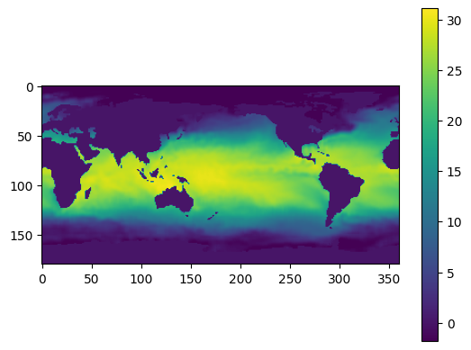
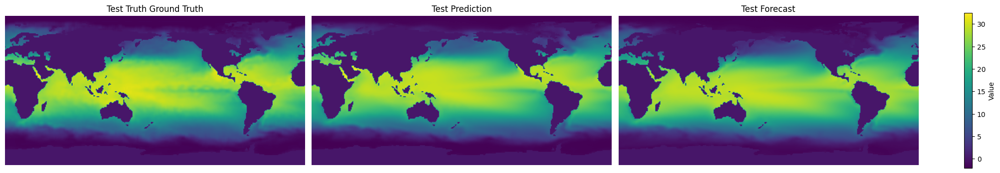

# Basic SHRED Tutorial on Sea Surface Temperature

#### Import Libraries


```python
# PYSHRED
import pyshred
from pyshred import DataManager, SHRED, SHREDEngine

# Other helper libraries
import matplotlib.pyplot as plt
from scipy.io import loadmat
import torch
import numpy as np
```

#### Load in SST Data


```python
sst_data = np.load("sst_data.npy")
```


```python
# Plotting a single frame
plt.figure()
plt.imshow(sst_data[0]) 
plt.colorbar()
plt.show()
```


    

    


#### Device Info


```python
device = pyshred.set_device("auto")
# device = pyshred.set_device("cpu") # force CPU
# device = pyshred.set_device("cuda") # force CUDA
# device = pyshred.set_device("mps") # force MPS
# device = pyshred.set_device("cuda", device_id=0) # force specific GPU
pyshred.device_info()
```

    === PyShred Device Information ===
    Current device: cpu
    Device config: DeviceConfig(device_type=<DeviceType.AUTO: 'auto'>, device_id=None, force_cpu=False, warn_on_fallback=True)
    
    Device Availability:
      CUDA available: False
      MPS available: False
      CPU: Always available
    

#### Initialize Data Manager


```python
manager = DataManager(
    lags = 52,
    train_size = 0.8,
    val_size = 0.1,
    test_size = 0.1,
)
```

#### Add datasets and sensors


```python
manager.add_data(
    data = "sst_data.npy",
    id = "SST",
    random = 3,
    # mobile=,
    # stationary=,
    # measurements=,
    compress=False,
    seed = 0, # fix the random sensor locations, for reproducible results
)
```

#### Analyze sensor summary


```python
manager.sensor_summary_df
```


<div>
<style scoped>
    .dataframe tbody tr th:only-of-type {
        vertical-align: middle;
    }

    .dataframe tbody tr th {
        vertical-align: top;
    }

    .dataframe thead th {
        text-align: right;
    }
</style>
<table border="1" class="dataframe">
  <thead>
    <tr style="text-align: right;">
      <th></th>
      <th>data id</th>
      <th>sensor_number</th>
      <th>type</th>
      <th>loc/traj</th>
    </tr>
  </thead>
  <tbody>
    <tr>
      <th>0</th>
      <td>SST</td>
      <td>0</td>
      <td>stationary (random)</td>
      <td>(71, 109)</td>
    </tr>
    <tr>
      <th>1</th>
      <td>SST</td>
      <td>1</td>
      <td>stationary (random)</td>
      <td>(74, 178)</td>
    </tr>
    <tr>
      <th>2</th>
      <td>SST</td>
      <td>2</td>
      <td>stationary (random)</td>
      <td>(94, 289)</td>
    </tr>
  </tbody>
</table>
</div>


```python
manager.sensor_measurements_df
```


<div>
<style scoped>
    .dataframe tbody tr th:only-of-type {
        vertical-align: middle;
    }

    .dataframe tbody tr th {
        vertical-align: top;
    }

    .dataframe thead th {
        text-align: right;
    }
</style>
<table border="1" class="dataframe">
  <thead>
    <tr style="text-align: right;">
      <th></th>
      <th>SST-0</th>
      <th>SST-1</th>
      <th>SST-2</th>
    </tr>
  </thead>
  <tbody>
    <tr>
      <th>0</th>
      <td>23.659999</td>
      <td>27.459999</td>
      <td>0.0</td>
    </tr>
    <tr>
      <th>1</th>
      <td>23.259999</td>
      <td>26.889999</td>
      <td>0.0</td>
    </tr>
    <tr>
      <th>2</th>
      <td>23.199999</td>
      <td>26.849999</td>
      <td>0.0</td>
    </tr>
    <tr>
      <th>3</th>
      <td>22.829999</td>
      <td>26.619999</td>
      <td>0.0</td>
    </tr>
    <tr>
      <th>4</th>
      <td>22.539999</td>
      <td>26.679999</td>
      <td>0.0</td>
    </tr>
    <tr>
      <th>...</th>
      <td>...</td>
      <td>...</td>
      <td>...</td>
    </tr>
    <tr>
      <th>1395</th>
      <td>28.929999</td>
      <td>29.249999</td>
      <td>0.0</td>
    </tr>
    <tr>
      <th>1396</th>
      <td>28.849999</td>
      <td>28.919999</td>
      <td>0.0</td>
    </tr>
    <tr>
      <th>1397</th>
      <td>28.989999</td>
      <td>28.889999</td>
      <td>0.0</td>
    </tr>
    <tr>
      <th>1398</th>
      <td>28.049999</td>
      <td>28.699999</td>
      <td>0.0</td>
    </tr>
    <tr>
      <th>1399</th>
      <td>28.459999</td>
      <td>28.589999</td>
      <td>0.0</td>
    </tr>
  </tbody>
</table>
<p>1400 rows × 3 columns</p>
</div>


#### Get train, validation, and test set


```python
train_dataset, val_dataset, test_dataset= manager.prepare()
```

#### Initialize SHRED


```python
torch.manual_seed(0) # fix the weight initialization, for reproducible results
shred = SHRED(sequence_model="LSTM", decoder_model="MLP", latent_forecaster="LSTM_Forecaster")
```

#### Fit SHRED


```python
val_errors = shred.fit(train_dataset=train_dataset, val_dataset=val_dataset, num_epochs=10, sindy_regularization=0)
print('val_errors:', val_errors)
```

    Fitting SHRED...
    Epoch 1: Average training loss = 0.078330
    Validation MSE (epoch 1): 0.037093
    Epoch 2: Average training loss = 0.036325
    Validation MSE (epoch 2): 0.034117
    Epoch 3: Average training loss = 0.033967
    Validation MSE (epoch 3): 0.034335
    Epoch 4: Average training loss = 0.033617
    Validation MSE (epoch 4): 0.034011
    Epoch 5: Average training loss = 0.033234
    Validation MSE (epoch 5): 0.033349
    Epoch 6: Average training loss = 0.031395
    Validation MSE (epoch 6): 0.027927
    Epoch 7: Average training loss = 0.018353
    Validation MSE (epoch 7): 0.014860
    Epoch 8: Average training loss = 0.012866
    Validation MSE (epoch 8): 0.012220
    Epoch 9: Average training loss = 0.011531
    Validation MSE (epoch 9): 0.011749
    Epoch 10: Average training loss = 0.011430
    Validation MSE (epoch 10): 0.011924
    val_errors: [0.03709267 0.03411689 0.03433465 0.03401148 0.03334907 0.02792729
     0.01485961 0.01222015 0.01174884 0.01192393]
    

#### Evaluate SHRED


```python
train_mse = shred.evaluate(dataset=train_dataset)
val_mse = shred.evaluate(dataset=val_dataset)
test_mse = shred.evaluate(dataset=test_dataset)
print(f"Train MSE: {train_mse:.3f}")
print(f"Val   MSE: {val_mse:.3f}")
print(f"Test  MSE: {test_mse:.3f}")
```

    Train MSE: 0.010
    Val   MSE: 0.012
    Test  MSE: 0.014
    

#### Initialize SHRED Engine for Downstream Tasks


```python
engine = SHREDEngine(manager, shred)
```

#### Sensor Measurements to Latent Space


```python
test_latent_from_sensors = engine.sensor_to_latent(manager.test_sensor_measurements)
```

#### Forecast Latent Space (No Sensor Measurements)


```python
val_latents = engine.sensor_to_latent(manager.val_sensor_measurements)
init_latents = val_latents[-shred.latent_forecaster.seed_length:] # seed forecaster with final lag timesteps of latent space from val
h = len(manager.test_sensor_measurements)
test_latent_from_forecaster = engine.forecast_latent(h=h, init_latents=init_latents)
```

#### Decode Latent Space to Full-State Space


```python
test_prediction = engine.decode(test_latent_from_sensors) # latent space generated from sensor data
test_forecast = engine.decode(test_latent_from_forecaster) # latent space generated from latent forecasted (no sensor data)
```

Compare final frame in prediction and forecast to ground truth:


```python
truth      = sst_data[-1]
prediction = test_prediction['SST'][-1]
forecast   = test_forecast['SST'][-1]

data   = [truth, prediction, forecast]
titles = ["Test Truth Ground Truth", "Test Prediction", "Test Forecast"]

vmin, vmax = np.min([d.min() for d in data]), np.max([d.max() for d in data])

fig, axes = plt.subplots(1, 3, figsize=(20, 4), constrained_layout=True)

for ax, d, title in zip(axes, data, titles):
    im = ax.imshow(d, vmin=vmin, vmax=vmax)
    ax.set(title=title)
    ax.axis("off")

fig.colorbar(im, ax=axes, label="Value", shrink=0.8)
```


    <matplotlib.colorbar.Colorbar at 0x20accb6d3a0>


    

    


#### Evaluate MSE on Ground Truth Data


```python
# Train
t_train = len(manager.train_sensor_measurements)
train_Y = {'SST': sst_data[0:t_train]}
train_error = engine.evaluate(manager.train_sensor_measurements, train_Y)

# Val
t_val = len(manager.val_sensor_measurements)
val_Y = {'SST': sst_data[t_train:t_train+t_val]}
val_error = engine.evaluate(manager.val_sensor_measurements, val_Y)

# Test
t_test = len(manager.test_sensor_measurements)
test_Y = {'SST': sst_data[-t_test:]}
test_error = engine.evaluate(manager.test_sensor_measurements, test_Y)

print('---------- TRAIN ----------')
print(train_error)
print('\n---------- VAL   ----------')
print(val_error)
print('\n---------- TEST  ----------')
print(test_error)
```

    ---------- TRAIN ----------
                  MSE      RMSE      MAE        R2
    dataset                                       
    SST      0.543765  0.737404  0.41998  0.406113
    
    ---------- VAL   ----------
                  MSE     RMSE       MAE        R2
    dataset                                       
    SST      0.908324  0.95306  0.496027 -0.398883
    
    ---------- TEST  ----------
                  MSE      RMSE       MAE        R2
    dataset                                        
    SST      0.780126  0.883248  0.507533 -0.444451
    
