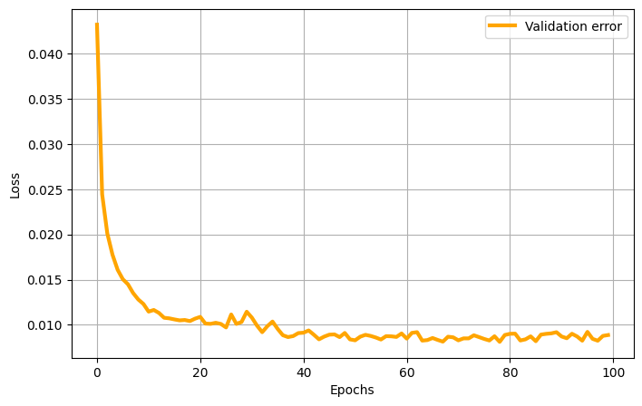

# SHRED-ROM Tutorial on Double Gyre Flow
**Authors:** Stefano Riva and Matteo Tomasetto

[](https://colab.research.google.com/drive/1MSmKFJPf0B81iAN2hjU-3IvFgimUBIc9)

The double gyre flow is a time-dependent model for two counter-rotating vortices (gyres) in a rectangular domain. When time is introduced via a periodic perturbation, the central dividing line between the two gyres oscillates left and right, creating a time-varying velocity field that can lead to chaotic particle trajectories. The velocity field $\mathbf{v} = [u, v]^T$ in the domain $[0, L_x] \times [0, L_y]$ and in the time interval $[0, T]$ is given by


$$
\begin{align}
u(x, y, t) &= -\pi I \sin\left( \pi f(x, t) \right) \cos\left( \pi y \right)
\\
v(x, y, t) &= \pi I \cos\left( \pi f(x, t) \right) \sin\left( \pi y \right) \frac{\partial f}{\partial x}
\end{align}
$$

\
where $I$ is the intensity parameter, $f(x, t) = \epsilon \sin(\omega t) x^2 + (1 - 2\epsilon \sin(\omega t)) x $, $\epsilon$ and $\omega$ are the perturbation amplitude and the frequency of the oscillation, respectively.


```python
%load_ext autoreload
%autoreload 2

# PYSHRED
from pyshred import DataManager, SHRED, SHREDEngine, LSTM_Forecaster

# IMPORT LIBRARIES
import torch
import numpy as np
import matplotlib.pyplot as plt
```

    c:\Tools\MiniConda\envs\datasci\lib\site-packages\pysindy\__init__.py:1: UserWarning: pkg_resources is deprecated as an API. See https://setuptools.pypa.io/en/latest/pkg_resources.html. The pkg_resources package is slated for removal as early as 2025-11-30. Refrain from using this package or pin to Setuptools<81.
      from pkg_resources import DistributionNotFound
    

A function to compute the velocity components $u$ and $v$ is provided below.


```python
# DEFINE THE SYSTEM SOLVER

def double_gyre_flow(amplitude, frequency, x, y, t):
    '''
    Solve the double gyre flow problem

    Inputs
        amplitude                   (`float`)
        frequency                   (`float`)
        horizontal discretization   (`np.array[float]`, shape: (ny,))
        vertical discretization     (`np.array[float]`, shape: (nx,))
        time vector                 (`np.array[float]`, shape: (ntimes,))

    Output
        horizontal velocity matrix  (`np.array[float]`, shape: (ntimes, nx * ny)
        vertical velocity matrix    (`np.array[float]`, shape: (ntimes, nx * ny)
    '''

    xgrid, ygrid = np.meshgrid(x, y)         # spatial grid

    u = np.zeros((len(t), len(x), len(y)))   # horizontal velocity
    v = np.zeros((len(t), len(x), len(y)))   # vertical velocity

    intensity = 0.1   # intensity parameter

    f = lambda x,t: amplitude * np.sin(frequency * t) * x**2 + x - 2 * amplitude * np.sin(frequency * t) * x

    # compute solution
    for i in range(len(t)):
      u[i] = (-np.pi * intensity * np.sin(np.pi * f(xgrid, t[i])) * np.cos(np.pi * ygrid)).T
      v[i] = (np.pi * intensity * np.cos(np.pi * f(xgrid, t[i])) * np.sin(np.pi * ygrid) * (2 * amplitude * np.sin(frequency * t[i]) * xgrid + 1.0 - 2 * amplitude * np.sin(frequency * t[i]))).T

    return u, v
```

Let us look at an example of the double gyre flow with the following parameters:
- Amplitude $\epsilon = 0.25$
- Frequency $\omega = 5$


```python
# SOLVE THE SYSTEM FOR A FIXED TRANSPORT TERM

amplitude = 0.25    # amplitude
frequency = 5.0     # frequency

# spatial discretization
nx = 50
ny = 25
Lx = 2.0
Ly = 1.0
x = np.linspace(0, Lx, nx)
y = np.linspace(0, Ly, ny)
nstate = len(x) * len(y)

# temporal discretization
dt = 0.05
T = 10.0
t = np.arange(0, T + dt, dt)
ntimes = len(t)

u, v = double_gyre_flow(amplitude, frequency, x, y, t)
```

Let us plot the solution, in terms of the vorticity field $w = -\partial u / \partial y + \partial v / \partial x$


```python
# SOLUTION VISUALIZATION

from ipywidgets import interact, FloatSlider
import matplotlib.patches as patches

def vorticity(u, v):
    dx = Lx / nx
    dy = Ly / ny
    du_dy = np.gradient(u, dy, axis = 1)
    dv_dx = np.gradient(v, dx, axis = 0)
    return dv_dx - du_dy

def plot_solution(time):

    which_time = (np.abs(t - time)).argmin()
    offset = 0.1

    plt.figure(figsize = (10,5))
    cont = plt.contourf(x, y, vorticity(u[which_time], v[which_time]).T, cmap = 'seismic', levels = 100)
    plt.colorbar(cont, label='Vorticity', orientation='vertical', pad=0.04, aspect=20, fraction=0.05)
    plt.streamplot(x, y, u[which_time].T, v[which_time].T, color='black', linewidth = 1, density = 1)
    plt.axis('off')
    plt.axis([0 - offset, Lx + offset, 0 - offset, Ly + offset])
    plt.title(f'Solution at time t = {round(time, 3)}')
    plt.grid(True)
    plt.gca().add_patch(patches.Rectangle((0, 0), Lx, Ly, linewidth = 5, edgecolor = 'black', facecolor = 'none'))


# interact(plot_solution, time = FloatSlider(value = t[0], min = t[0], max = t[-1], step = (t[1]-t[0]), description='time', layout={'width': '400px', 'height': '50px'}))
plot_solution(t[-1])
```


    

    


Let us generate the snapshots by sampling the velocity field for parameters $\epsilon\in [0,0.5]$, $\omega \in [0.5, 2\pi]$ (randomly sampled).


```python
# DATA GENERATION

amplitude_range = np.array([0.0, 0.5])
frequency_range = np.array([0.5, 2*np.pi])

# spatial discretization
nx = 50
ny = 25
Lx = 2.0
Ly = 1.0
x = np.linspace(0, Lx, nx)
y = np.linspace(0, Ly, ny)
nstate = len(x) * len(y)

# temporal discretization
dt = 0.05
T = 10.0
t = np.arange(0, T + dt, dt)
ntimes = len(t)

# training data generation
ntrajectories = 100
U = np.zeros((ntrajectories, ntimes, nx, ny))
V = np.zeros((ntrajectories, ntimes, nx, ny))

parameters = np.zeros((ntrajectories, ntimes, 2))  # store amplitude and frequency

for i in range(ntrajectories):
  amplitude = (amplitude_range[1] - amplitude_range[0]) * np.random.rand() + amplitude_range[0]
  frequency = (frequency_range[1] - frequency_range[0]) * np.random.rand() + frequency_range[0]
  U[i], V[i] = double_gyre_flow(amplitude, frequency, x, y, t)

  parameters[i, :, 0] = amplitude
  parameters[i, :, 1] = frequency
```

Here a trajectory is visualized


```python
# DATA VISUALIZATION

from ipywidgets import interact, IntSlider

def plot_data(which_trajectory, which_time):

    offset = 0.1

    plt.figure(figsize = (10,5))
    cont = plt.contourf(x, y, vorticity(U[which_trajectory, which_time], V[which_trajectory, which_time]).T, cmap = 'seismic', levels = 100)
    plt.colorbar(cont, label='Vorticity', orientation='vertical', pad=0.04, aspect=20, fraction=0.05)
    plt.streamplot(x, y, U[which_trajectory, which_time].T, V[which_trajectory, which_time].T, color='black', linewidth = 1, density = 1)
    plt.axis('off')
    plt.axis([0 - offset, Lx + offset, 0 - offset, Ly + offset])
    plt.title(f'Trajectory {which_trajectory} at time t = {round(t[which_time], 3)}')
    plt.grid(True)
    plt.gca().add_patch(patches.Rectangle((0, 0), Lx, Ly, linewidth = 5, edgecolor = 'black', facecolor = 'none'))

# interact(plot_data, which_trajectory = IntSlider(min = 0, max = ntrajectories - 1, step = 1, description='Trajectory'), which_time = IntSlider(min = 0, max = ntimes - 1, step = 1, description='Time step'));
plot_data(50, -1)
```


    

    


## **SHallow REcurrent Decoder networks-based Reduced Order Modeling (SHRED-ROM)**

Let us assume to have three sensors in the domain measuring the horizontal velocity $u(x_s,y_s,t;\epsilon, \omega)$ over time. *SHRED-ROM* aims to reconstruct the temporal evolution of the entire velocity $\mathbf{v}(x,y,t;\epsilon, \omega) = [u(x,y,t;\epsilon, \omega), v(x,y,t;\epsilon, \omega)]^T$ starting from the limited sensor measurements available. In general, *SHRED-ROM* combines a recurrent neural network (LSTM), which encodes the temporal history of sensor values in multiple parametric regimes, and a shallow decoder, which projects the LSTM prediction to the (possibly high-dimensional) state dimension. Note that, to enhance computational efficiency and memory usage, dimensionality reduction strategies (such as, e.g., POD) may be considered to compress the training snapshots.

Two different compression strategies are available in this tutorial:
1. **POD**: Proper Orthogonal Decomposition, which computes the low-rank approximation of the training snapshots.
2. **Fourier**: Fourier decomposition, which computes the Fourier coefficients of the training snapshots.


```python
U = U.reshape(ntrajectories, ntimes, nstate)
V = V.reshape(ntrajectories, ntimes, nstate)
```

### POD-based compressive training
The `ParametricDataManager` is initialized


```python
from pyshred import ParametricDataManager, SHRED, ParametricSHREDEngine

# Initialize ParametricSHREDDataManager
manager_pod = ParametricDataManager(
    lags = 25,
    train_size = 0.8,
    val_size = 0.1,
    test_size = 0.1,
    )

import warnings
warnings.filterwarnings("ignore")
```

Let us add the different fields, the component $u$ is the one we want to reconstruct, while $v$ is indirectly reconstructed. The parameters $\epsilon$ and $\omega$ are included as output of the SHRED architecture.


```python
manager_pod.add_data(
    data=U,        # 3D array (parametric_trajectories, timesteps, field_dim)
    id="U",        # Unique identifier for the dataset
    random=3,      # Randomly select 3 sensor locations
    compress=4     # Spatial compression
)

## Since no random selection is specified for the second dataset, no measurement locations will be selected
manager_pod.add_data(
    data=V,         
    id="V",        
    compress=4     
)

## Add parameters to the manager
manager_pod.add_data(
    data=parameters,
    id='mu',
    compress=False,
)
```

If you want to add noise to the measurements (zero-mean Gaussian), it can added as follows:


```python
manager_pod.sensor_summary_df
```


<div>
<style scoped>
    .dataframe tbody tr th:only-of-type {
        vertical-align: middle;
    }

    .dataframe tbody tr th {
        vertical-align: top;
    }

    .dataframe thead th {
        text-align: right;
    }
</style>
<table border="1" class="dataframe">
  <thead>
    <tr style="text-align: right;">
      <th></th>
      <th>data id</th>
      <th>sensor_number</th>
      <th>type</th>
      <th>loc/traj</th>
    </tr>
  </thead>
  <tbody>
    <tr>
      <th>0</th>
      <td>U</td>
      <td>0</td>
      <td>stationary (random)</td>
      <td>(475,)</td>
    </tr>
    <tr>
      <th>1</th>
      <td>U</td>
      <td>1</td>
      <td>stationary (random)</td>
      <td>(944,)</td>
    </tr>
    <tr>
      <th>2</th>
      <td>U</td>
      <td>2</td>
      <td>stationary (random)</td>
      <td>(1163,)</td>
    </tr>
  </tbody>
</table>
</div>


```python
noise_std = 0.005
random_noise = np.random.normal(loc=0, scale=noise_std, size=manager_pod.sensor_measurements_df.shape)

manager_pod.sensor_measurements_df += random_noise
```

Let us prepare the data by splitting them into train, valid and test sets.


```python
train_dataset, val_dataset, test_dataset = manager_pod.prepare()
```

**Definition of the SHRED architecture**


```python
shred_pod = SHRED(
    sequence_model="LSTM",
    decoder_model="MLP",
    latent_forecaster=None
)
```

Let us fit the SHRED architecture


```python
val_errors_shredpod = shred_pod.fit(
    train_dataset=train_dataset,
    val_dataset=val_dataset,
    num_epochs=100,
    patience=50,
    verbose=True,
)
```

    Fitting SHRED...
    Epoch 1: Average training loss = 0.053392
    Validation MSE (epoch 1): 0.043212
    Epoch 2: Average training loss = 0.032544
    Validation MSE (epoch 2): 0.024448
    Epoch 3: Average training loss = 0.023836
    Validation MSE (epoch 3): 0.020105
    Epoch 4: Average training loss = 0.020569
    Validation MSE (epoch 4): 0.017764
    Epoch 5: Average training loss = 0.020235
    Validation MSE (epoch 5): 0.016091
    Epoch 6: Average training loss = 0.017805
    Validation MSE (epoch 6): 0.015052
    Epoch 7: Average training loss = 0.016603
    Validation MSE (epoch 7): 0.014485
    Epoch 8: Average training loss = 0.015684
    Validation MSE (epoch 8): 0.013516
    Epoch 9: Average training loss = 0.014828
    Validation MSE (epoch 9): 0.012803
    Epoch 10: Average training loss = 0.014153
    Validation MSE (epoch 10): 0.012308
    Epoch 11: Average training loss = 0.012916
    Validation MSE (epoch 11): 0.011462
    Epoch 12: Average training loss = 0.012554
    Validation MSE (epoch 12): 0.011643
    Epoch 13: Average training loss = 0.012317
    Validation MSE (epoch 13): 0.011317
    Epoch 14: Average training loss = 0.011726
    Validation MSE (epoch 14): 0.010781
    Epoch 15: Average training loss = 0.011202
    Validation MSE (epoch 15): 0.010718
    Epoch 16: Average training loss = 0.011886
    Validation MSE (epoch 16): 0.010599
    Epoch 17: Average training loss = 0.010680
    Validation MSE (epoch 17): 0.010494
    Epoch 18: Average training loss = 0.010582
    Validation MSE (epoch 18): 0.010536
    Epoch 19: Average training loss = 0.010798
    Validation MSE (epoch 19): 0.010416
    Epoch 20: Average training loss = 0.012638
    Validation MSE (epoch 20): 0.010685
    Epoch 21: Average training loss = 0.011090
    Validation MSE (epoch 21): 0.010882
    Epoch 22: Average training loss = 0.010860
    Validation MSE (epoch 22): 0.010139
    Epoch 23: Average training loss = 0.009818
    Validation MSE (epoch 23): 0.010109
    Epoch 24: Average training loss = 0.009808
    Validation MSE (epoch 24): 0.010227
    Epoch 25: Average training loss = 0.010899
    Validation MSE (epoch 25): 0.010099
    Epoch 26: Average training loss = 0.009603
    Validation MSE (epoch 26): 0.009711
    Epoch 27: Average training loss = 0.009637
    Validation MSE (epoch 27): 0.011148
    Epoch 28: Average training loss = 0.010233
    Validation MSE (epoch 28): 0.010103
    Epoch 29: Average training loss = 0.009630
    Validation MSE (epoch 29): 0.010315
    Epoch 30: Average training loss = 0.009985
    Validation MSE (epoch 30): 0.011453
    Epoch 31: Average training loss = 0.009584
    Validation MSE (epoch 31): 0.010798
    Epoch 32: Average training loss = 0.010244
    Validation MSE (epoch 32): 0.009911
    Epoch 33: Average training loss = 0.009551
    Validation MSE (epoch 33): 0.009187
    Epoch 34: Average training loss = 0.009350
    Validation MSE (epoch 34): 0.009849
    Epoch 35: Average training loss = 0.009357
    Validation MSE (epoch 35): 0.010362
    Epoch 36: Average training loss = 0.009954
    Validation MSE (epoch 36): 0.009548
    Epoch 37: Average training loss = 0.008973
    Validation MSE (epoch 37): 0.008852
    Epoch 38: Average training loss = 0.008628
    Validation MSE (epoch 38): 0.008646
    Epoch 39: Average training loss = 0.009700
    Validation MSE (epoch 39): 0.008757
    Epoch 40: Average training loss = 0.008890
    Validation MSE (epoch 40): 0.009087
    Epoch 41: Average training loss = 0.009133
    Validation MSE (epoch 41): 0.009129
    Epoch 42: Average training loss = 0.009283
    Validation MSE (epoch 42): 0.009379
    Epoch 43: Average training loss = 0.009310
    Validation MSE (epoch 43): 0.008910
    Epoch 44: Average training loss = 0.008548
    Validation MSE (epoch 44): 0.008397
    Epoch 45: Average training loss = 0.009379
    Validation MSE (epoch 45): 0.008696
    Epoch 46: Average training loss = 0.008745
    Validation MSE (epoch 46): 0.008912
    Epoch 47: Average training loss = 0.008402
    Validation MSE (epoch 47): 0.008942
    Epoch 48: Average training loss = 0.009491
    Validation MSE (epoch 48): 0.008642
    Epoch 49: Average training loss = 0.009496
    Validation MSE (epoch 49): 0.009101
    Epoch 50: Average training loss = 0.008552
    Validation MSE (epoch 50): 0.008392
    Epoch 51: Average training loss = 0.008369
    Validation MSE (epoch 51): 0.008288
    Epoch 52: Average training loss = 0.008182
    Validation MSE (epoch 52): 0.008690
    Epoch 53: Average training loss = 0.009040
    Validation MSE (epoch 53): 0.008894
    Epoch 54: Average training loss = 0.009361
    Validation MSE (epoch 54): 0.008774
    Epoch 55: Average training loss = 0.008573
    Validation MSE (epoch 55): 0.008599
    Epoch 56: Average training loss = 0.008240
    Validation MSE (epoch 56): 0.008375
    Epoch 57: Average training loss = 0.009257
    Validation MSE (epoch 57): 0.008748
    Epoch 58: Average training loss = 0.008524
    Validation MSE (epoch 58): 0.008730
    Epoch 59: Average training loss = 0.008825
    Validation MSE (epoch 59): 0.008662
    Epoch 60: Average training loss = 0.008659
    Validation MSE (epoch 60): 0.009045
    Epoch 61: Average training loss = 0.008629
    Validation MSE (epoch 61): 0.008477
    Epoch 62: Average training loss = 0.008819
    Validation MSE (epoch 62): 0.009109
    Epoch 63: Average training loss = 0.009125
    Validation MSE (epoch 63): 0.009190
    Epoch 64: Average training loss = 0.008607
    Validation MSE (epoch 64): 0.008255
    Epoch 65: Average training loss = 0.008780
    Validation MSE (epoch 65): 0.008314
    Epoch 66: Average training loss = 0.008238
    Validation MSE (epoch 66): 0.008542
    Epoch 67: Average training loss = 0.008058
    Validation MSE (epoch 67): 0.008330
    Epoch 68: Average training loss = 0.008453
    Validation MSE (epoch 68): 0.008142
    Epoch 69: Average training loss = 0.008290
    Validation MSE (epoch 69): 0.008686
    Epoch 70: Average training loss = 0.008986
    Validation MSE (epoch 70): 0.008616
    Epoch 71: Average training loss = 0.008293
    Validation MSE (epoch 71): 0.008285
    Epoch 72: Average training loss = 0.007972
    Validation MSE (epoch 72): 0.008500
    Epoch 73: Average training loss = 0.008440
    Validation MSE (epoch 73): 0.008502
    Epoch 74: Average training loss = 0.008352
    Validation MSE (epoch 74): 0.008844
    Epoch 75: Average training loss = 0.008634
    Validation MSE (epoch 75): 0.008645
    Epoch 76: Average training loss = 0.008283
    Validation MSE (epoch 76): 0.008440
    Epoch 77: Average training loss = 0.008036
    Validation MSE (epoch 77): 0.008269
    Epoch 78: Average training loss = 0.007970
    Validation MSE (epoch 78): 0.008736
    Epoch 79: Average training loss = 0.007901
    Validation MSE (epoch 79): 0.008116
    Epoch 80: Average training loss = 0.008635
    Validation MSE (epoch 80): 0.008874
    Epoch 81: Average training loss = 0.008524
    Validation MSE (epoch 81): 0.009008
    Epoch 82: Average training loss = 0.008374
    Validation MSE (epoch 82): 0.009022
    Epoch 83: Average training loss = 0.008425
    Validation MSE (epoch 83): 0.008268
    Epoch 84: Average training loss = 0.008225
    Validation MSE (epoch 84): 0.008397
    Epoch 85: Average training loss = 0.007887
    Validation MSE (epoch 85): 0.008727
    Epoch 86: Average training loss = 0.008008
    Validation MSE (epoch 86): 0.008191
    Epoch 87: Average training loss = 0.008014
    Validation MSE (epoch 87): 0.008919
    Epoch 88: Average training loss = 0.008429
    Validation MSE (epoch 88): 0.009004
    Epoch 89: Average training loss = 0.008337
    Validation MSE (epoch 89): 0.009056
    Epoch 90: Average training loss = 0.008528
    Validation MSE (epoch 90): 0.009185
    Epoch 91: Average training loss = 0.008492
    Validation MSE (epoch 91): 0.008710
    Epoch 92: Average training loss = 0.008400
    Validation MSE (epoch 92): 0.008518
    Epoch 93: Average training loss = 0.008053
    Validation MSE (epoch 93): 0.009015
    Epoch 94: Average training loss = 0.007976
    Validation MSE (epoch 94): 0.008710
    Epoch 95: Average training loss = 0.008299
    Validation MSE (epoch 95): 0.008247
    Epoch 96: Average training loss = 0.007863
    Validation MSE (epoch 96): 0.009222
    Epoch 97: Average training loss = 0.007938
    Validation MSE (epoch 97): 0.008448
    Epoch 98: Average training loss = 0.007993
    Validation MSE (epoch 98): 0.008244
    Epoch 99: Average training loss = 0.008099
    Validation MSE (epoch 99): 0.008777
    Epoch 100: Average training loss = 0.008017
    Validation MSE (epoch 100): 0.008872
    

Here the validation loss is plotted


```python
plt.figure(figsize = (8,5))
plt.plot(val_errors_shredpod, 'orange', linewidth = 3, label = 'Validation error')
plt.xlabel('Epochs')
plt.ylabel('Loss')
plt.legend()
plt.grid(True)
```


    

    


Let us evaluate the SHRED model on the different sets


```python
print(f"Train MSE: {shred_pod.evaluate(dataset=train_dataset):.3f}")
print(f"Val   MSE: {shred_pod.evaluate(dataset=val_dataset):.3f}")
print(f"Test  MSE: {shred_pod.evaluate(dataset=test_dataset):.3f}")
```

    Train MSE: 0.008
    Val   MSE: 0.009
    Test  MSE: 0.007
    

Let us check the reconstruction of the POD coefficients


```python
which_param = 0  # Index of the parameter to visualize

fig, axs = plt.subplots(2, 4, figsize=(20, 8))

for i in range(4):
    axs[0, i].plot(test_dataset.Y[ntimes * which_param:ntimes * (which_param + 1), i].cpu().numpy(), 'b', label='True U')
    axs[0, i].plot(shred_pod(test_dataset.X)[ntimes * which_param:ntimes * (which_param + 1), i].cpu().detach().numpy(), 'r--', label='True U')

    axs[1, i].plot(test_dataset.Y[ntimes * which_param:ntimes * (which_param + 1), i + 4].cpu().numpy(), 'b', label='True V')
    axs[1, i].plot(shred_pod(test_dataset.X)[ntimes * which_param:ntimes * (which_param + 1), i + 4].cpu().detach().numpy(), 'r--', label='True V')
```


    

    


Let us check the reconstruction of the double gyre flow

### Fourier-based compressive training


```python
freq_cutoff = 0.05

freq_x = np.fft.fftfreq(nx)
freq_y = np.fft.fftfreq(ny)
freq_x_grid, freq_y_grid = np.meshgrid(freq_x, freq_y)
mask_x = np.abs(freq_x_grid.T) <= freq_cutoff

# Transform the data to frequency domain - U
U_fft = np.fft.fft2(U.reshape(ntrajectories, ntimes, nx, ny), axes = (-2, -1))
U_fft[:,:,~mask_x] = 0
U_proj = U_fft[:,:,mask_x]
U_proj_real = np.real(U_proj)
U_proj_imag = np.imag(U_proj)

Fourier_modes_x = U_proj.shape[-1]

# Transform the data to frequency domain - V
mask_y = np.abs(freq_y_grid.T) <= freq_cutoff
V_fft = np.fft.fft2(V.reshape(ntrajectories, ntimes, nx, ny), axes = (-2, -1))
V_fft[:,:,~mask_y] = 0
V_proj = V_fft[:,:,mask_y]
V_proj_real = np.real(V_proj)
V_proj_imag = np.imag(V_proj)

Fourier_modes_y = V_proj.shape[-1]
```

Let us plot the projected and reconstructed velocity fields


```python
U_recons = np.fft.ifft2(U_fft).real
V_recons = np.fft.ifft2(V_fft).real

def plot_fourier_data(which_test_trajectory, which_time):

    offset = 0.1

    _min = vorticity(U[which_test_trajectory, which_time].reshape(nx, ny),  V[which_test_trajectory, which_time].reshape(nx, ny)).min()
    _max = vorticity(U[which_test_trajectory, which_time].reshape(nx, ny),  V[which_test_trajectory, which_time].reshape(nx, ny)).max()

    levels = np.linspace(_min, _max, 100) * 1.05

    plt.figure(figsize = (20,5))
    plt.subplot(1, 2, 1)
    cont = plt.contourf(x, y, vorticity(U[which_test_trajectory, which_time].reshape(nx, ny),  V[which_test_trajectory, which_time].reshape(nx, ny)).T, cmap = 'seismic', levels = levels)
    plt.streamplot(x, y, U[which_test_trajectory, which_time].reshape(nx, ny).T, V[which_test_trajectory, which_time].reshape(nx, ny).T, color='black', linewidth = 1, density = 1)
    plt.axis('off')
    plt.axis([0 - offset, Lx + offset, 0 - offset, Ly + offset])
    plt.title(f'Case {which_test_trajectory} at time t = {round(t[which_time], 3)}')
    plt.grid(True)
    plt.gca().add_patch(patches.Rectangle((0, 0), Lx, Ly, linewidth = 5, edgecolor = 'black', facecolor = 'none'))
    plt.colorbar(cont, label='Vorticity', orientation='vertical', pad=0.04, aspect=20, fraction=0.05)

    plt.subplot(1, 2, 2)
    cont = plt.contourf(x, y, vorticity(U_recons[which_test_trajectory, which_time].reshape(nx, ny),  V_recons[which_test_trajectory, which_time].reshape(nx, ny)).T, cmap = 'seismic', levels = levels)
    plt.streamplot(x, y, U_recons[which_test_trajectory, which_time].reshape(nx, ny).T, V_recons[which_test_trajectory, which_time].reshape(nx, ny).T, color='black', linewidth = 1, density = 1)
    plt.axis('off')
    plt.axis([0 - offset, Lx + offset, 0 - offset, Ly + offset])
    plt.title(f'Fourier reconstruction at time t = {round(t[which_time], 3)}')
    plt.grid(True)
    plt.gca().add_patch(patches.Rectangle((0, 0), Lx, Ly, linewidth = 5, edgecolor = 'black', facecolor = 'none'))
    plt.colorbar(cont, label='Vorticity', orientation='vertical', pad=0.04, aspect=20, fraction=0.05)

# interact(plot_fourier_data, which_test_trajectory = IntSlider(min = 0, max = ntrajectories - 1, step = 1, description='Test case'), which_time = IntSlider(min = 0, max = ntimes - 1, step = 1, description='Time step'));

plot_fourier_data(50, -1)
```


    

    


Let us compute the measurement field from $u$ using the same input positions as before


```python
sens_locs = [manager_pod.sensor_summary_df['loc/traj'][i][0] for i in range(len(manager_pod.sensor_summary_df))]

measurements = U[:, :, sens_locs]

# Add noise to the measurements
measurements += np.random.normal(loc=0, scale=noise_std, size=measurements.shape)
```

Let us initialize the `ParametricDataManager` for Fourier-based training


```python
manager_fourier = ParametricDataManager(
    lags = 25,
    train_size = 0.8,
    val_size = 0.1,
    test_size = 0.1
)
```

Let us add the different fields, the component $u$ is the one we want to reconstruct, while $v$ is indirectly reconstructed. The parameters $\epsilon$ and $\omega$ are included as output of the SHRED architecture.


```python
# Real and imaginary parts have to be added separately
manager_fourier.add_data(
    data=U_proj_real,        
    id="Ufft_real",        
    measurements=measurements,  # Use the measurements with noise already computed
    compress=False
)

manager_fourier.add_data(
    data=U_proj_imag,        
    id="Ufft_imag",        
    compress=False
)

# Add the second dataset (V) in the same way
manager_fourier.add_data(
    data=V_proj_real,        
    id="Vfft_real",        
    compress=False
)

manager_fourier.add_data(
    data=V_proj_imag,        
    id="Vfft_imag",        
    compress=False
)

## Add parameters to the manager
manager_fourier.add_data(
    data=parameters,
    id='mu',
    compress=False,
)
```

Let us prepare the data by splitting them into train, valid and test sets.


```python
train_dataset, val_dataset, test_dataset= manager_fourier.prepare()
```

**Definition of the SHRED architecture**


```python
shred_fourier = SHRED(
    sequence_model="LSTM",
    decoder_model="MLP",
    latent_forecaster=None
)
```

Let us fit the SHRED architecture


```python
val_errors_shredfourier = shred_fourier.fit(
    train_dataset=train_dataset,
    val_dataset=val_dataset,
    num_epochs=100,
    patience=50,
    verbose=True,
)
```

    Fitting SHRED...
    Epoch 1: Average training loss = 0.053214
    Validation MSE (epoch 1): 0.014368
    Epoch 2: Average training loss = 0.009338
    Validation MSE (epoch 2): 0.002854
    Epoch 3: Average training loss = 0.003565
    Validation MSE (epoch 3): 0.002174
    Epoch 4: Average training loss = 0.002810
    Validation MSE (epoch 4): 0.002424
    Epoch 5: Average training loss = 0.002591
    Validation MSE (epoch 5): 0.002467
    Epoch 6: Average training loss = 0.002366
    Validation MSE (epoch 6): 0.002638
    Epoch 7: Average training loss = 0.002098
    Validation MSE (epoch 7): 0.002637
    Epoch 8: Average training loss = 0.002073
    Validation MSE (epoch 8): 0.002461
    Epoch 9: Average training loss = 0.001950
    Validation MSE (epoch 9): 0.002186
    Epoch 10: Average training loss = 0.001827
    Validation MSE (epoch 10): 0.001497
    Epoch 11: Average training loss = 0.001761
    Validation MSE (epoch 11): 0.002201
    Epoch 12: Average training loss = 0.001868
    Validation MSE (epoch 12): 0.001741
    Epoch 13: Average training loss = 0.001829
    Validation MSE (epoch 13): 0.001406
    Epoch 14: Average training loss = 0.001564
    Validation MSE (epoch 14): 0.000949
    Epoch 15: Average training loss = 0.001443
    Validation MSE (epoch 15): 0.001649
    Epoch 16: Average training loss = 0.001596
    Validation MSE (epoch 16): 0.001515
    Epoch 17: Average training loss = 0.001473
    Validation MSE (epoch 17): 0.001312
    Epoch 18: Average training loss = 0.001542
    Validation MSE (epoch 18): 0.001377
    Epoch 19: Average training loss = 0.001395
    Validation MSE (epoch 19): 0.000952
    Epoch 20: Average training loss = 0.001472
    Validation MSE (epoch 20): 0.001084
    Epoch 21: Average training loss = 0.001362
    Validation MSE (epoch 21): 0.000774
    Epoch 22: Average training loss = 0.001382
    Validation MSE (epoch 22): 0.000952
    Epoch 23: Average training loss = 0.001441
    Validation MSE (epoch 23): 0.000849
    Epoch 24: Average training loss = 0.001232
    Validation MSE (epoch 24): 0.000727
    Epoch 25: Average training loss = 0.001298
    Validation MSE (epoch 25): 0.000755
    Epoch 26: Average training loss = 0.001199
    Validation MSE (epoch 26): 0.000796
    Epoch 27: Average training loss = 0.001209
    Validation MSE (epoch 27): 0.000661
    Epoch 28: Average training loss = 0.001163
    Validation MSE (epoch 28): 0.000740
    Epoch 29: Average training loss = 0.001612
    Validation MSE (epoch 29): 0.001174
    Epoch 30: Average training loss = 0.001284
    Validation MSE (epoch 30): 0.001166
    Epoch 31: Average training loss = 0.001203
    Validation MSE (epoch 31): 0.000725
    Epoch 32: Average training loss = 0.001064
    Validation MSE (epoch 32): 0.000688
    Epoch 33: Average training loss = 0.001235
    Validation MSE (epoch 33): 0.000697
    Epoch 34: Average training loss = 0.001176
    Validation MSE (epoch 34): 0.000649
    Epoch 35: Average training loss = 0.001130
    Validation MSE (epoch 35): 0.000714
    Epoch 36: Average training loss = 0.001193
    Validation MSE (epoch 36): 0.000629
    Epoch 37: Average training loss = 0.001058
    Validation MSE (epoch 37): 0.000981
    Epoch 38: Average training loss = 0.001134
    Validation MSE (epoch 38): 0.000861
    Epoch 39: Average training loss = 0.001018
    Validation MSE (epoch 39): 0.000646
    Epoch 40: Average training loss = 0.001256
    Validation MSE (epoch 40): 0.000579
    Epoch 41: Average training loss = 0.001010
    Validation MSE (epoch 41): 0.000648
    Epoch 42: Average training loss = 0.001218
    Validation MSE (epoch 42): 0.000690
    Epoch 43: Average training loss = 0.001235
    Validation MSE (epoch 43): 0.000734
    Epoch 44: Average training loss = 0.000943
    Validation MSE (epoch 44): 0.000873
    Epoch 45: Average training loss = 0.001144
    Validation MSE (epoch 45): 0.000890
    Epoch 46: Average training loss = 0.001066
    Validation MSE (epoch 46): 0.000592
    Epoch 47: Average training loss = 0.001009
    Validation MSE (epoch 47): 0.000591
    Epoch 48: Average training loss = 0.001000
    Validation MSE (epoch 48): 0.000613
    Epoch 49: Average training loss = 0.000923
    Validation MSE (epoch 49): 0.000506
    Epoch 50: Average training loss = 0.000933
    Validation MSE (epoch 50): 0.000656
    Epoch 51: Average training loss = 0.001386
    Validation MSE (epoch 51): 0.000699
    Epoch 52: Average training loss = 0.001073
    Validation MSE (epoch 52): 0.000702
    Epoch 53: Average training loss = 0.000911
    Validation MSE (epoch 53): 0.000505
    Epoch 54: Average training loss = 0.000926
    Validation MSE (epoch 54): 0.000537
    Epoch 55: Average training loss = 0.000932
    Validation MSE (epoch 55): 0.000949
    Epoch 56: Average training loss = 0.001036
    Validation MSE (epoch 56): 0.000506
    Epoch 57: Average training loss = 0.000810
    Validation MSE (epoch 57): 0.000494
    Epoch 58: Average training loss = 0.000988
    Validation MSE (epoch 58): 0.001143
    Epoch 59: Average training loss = 0.001064
    Validation MSE (epoch 59): 0.000634
    Epoch 60: Average training loss = 0.000976
    Validation MSE (epoch 60): 0.000669
    Epoch 61: Average training loss = 0.001232
    Validation MSE (epoch 61): 0.001047
    Epoch 62: Average training loss = 0.001322
    Validation MSE (epoch 62): 0.000439
    Epoch 63: Average training loss = 0.000888
    Validation MSE (epoch 63): 0.000468
    Epoch 64: Average training loss = 0.000788
    Validation MSE (epoch 64): 0.000383
    Epoch 65: Average training loss = 0.000991
    Validation MSE (epoch 65): 0.001318
    Epoch 66: Average training loss = 0.001477
    Validation MSE (epoch 66): 0.000416
    Epoch 67: Average training loss = 0.000773
    Validation MSE (epoch 67): 0.000427
    Epoch 68: Average training loss = 0.000764
    Validation MSE (epoch 68): 0.000449
    Epoch 69: Average training loss = 0.000971
    Validation MSE (epoch 69): 0.000827
    Epoch 70: Average training loss = 0.001155
    Validation MSE (epoch 70): 0.000603
    Epoch 71: Average training loss = 0.000876
    Validation MSE (epoch 71): 0.000527
    Epoch 72: Average training loss = 0.000976
    Validation MSE (epoch 72): 0.000741
    Epoch 73: Average training loss = 0.000947
    Validation MSE (epoch 73): 0.000429
    Epoch 74: Average training loss = 0.000782
    Validation MSE (epoch 74): 0.000468
    Epoch 75: Average training loss = 0.000982
    Validation MSE (epoch 75): 0.000553
    Epoch 76: Average training loss = 0.000833
    Validation MSE (epoch 76): 0.000803
    Epoch 77: Average training loss = 0.001219
    Validation MSE (epoch 77): 0.000414
    Epoch 78: Average training loss = 0.000833
    Validation MSE (epoch 78): 0.000634
    Epoch 79: Average training loss = 0.001068
    Validation MSE (epoch 79): 0.000565
    Epoch 80: Average training loss = 0.000867
    Validation MSE (epoch 80): 0.000467
    Epoch 81: Average training loss = 0.000816
    Validation MSE (epoch 81): 0.000801
    Epoch 82: Average training loss = 0.001068
    Validation MSE (epoch 82): 0.000459
    Epoch 83: Average training loss = 0.000783
    Validation MSE (epoch 83): 0.000701
    Epoch 84: Average training loss = 0.001152
    Validation MSE (epoch 84): 0.000449
    Epoch 85: Average training loss = 0.000783
    Validation MSE (epoch 85): 0.000539
    Epoch 86: Average training loss = 0.000833
    Validation MSE (epoch 86): 0.000465
    Epoch 87: Average training loss = 0.000915
    Validation MSE (epoch 87): 0.000623
    Epoch 88: Average training loss = 0.001241
    Validation MSE (epoch 88): 0.000599
    Epoch 89: Average training loss = 0.000789
    Validation MSE (epoch 89): 0.000390
    Epoch 90: Average training loss = 0.000811
    Validation MSE (epoch 90): 0.000701
    Epoch 91: Average training loss = 0.001071
    Validation MSE (epoch 91): 0.000406
    Epoch 92: Average training loss = 0.000641
    Validation MSE (epoch 92): 0.000391
    Epoch 93: Average training loss = 0.000959
    Validation MSE (epoch 93): 0.000939
    Epoch 94: Average training loss = 0.001173
    Validation MSE (epoch 94): 0.000604
    Epoch 95: Average training loss = 0.000865
    Validation MSE (epoch 95): 0.000566
    Epoch 96: Average training loss = 0.000913
    Validation MSE (epoch 96): 0.000532
    Epoch 97: Average training loss = 0.000797
    Validation MSE (epoch 97): 0.000440
    Epoch 98: Average training loss = 0.001028
    Validation MSE (epoch 98): 0.000908
    Epoch 99: Average training loss = 0.001091
    Validation MSE (epoch 99): 0.000527
    Epoch 100: Average training loss = 0.000909
    Validation MSE (epoch 100): 0.000503
    

Here the validation loss is plotted


```python
plt.figure(figsize = (8,5))
plt.plot(val_errors_shredfourier, 'orange', linewidth = 3, label = 'Validation error')
plt.xlabel('Epochs')
plt.ylabel('Loss')
plt.legend()
plt.grid(True)
```


    

    


Let us evaluate the SHRED model on the different sets


```python
print(f"Train MSE: {shred_fourier.evaluate(dataset=train_dataset):.5f}")
print(f"Val   MSE: {shred_fourier.evaluate(dataset=val_dataset):.5f}")
print(f"Test  MSE: {shred_fourier.evaluate(dataset=test_dataset):.5f}")
```

    Train MSE: 0.00050
    Val   MSE: 0.00050
    Test  MSE: 0.00054
    

Let us check the reconstruction of the Fourier coefficients


```python
which_param = 5  # Index of the parameter to visualize

fig, axs = plt.subplots(2, 4, figsize=(20, 8))

for i in range(4):
    axs[0, i].plot(test_dataset.Y[ntimes * which_param:ntimes * (which_param + 1), i].cpu().numpy(), 'b', label='True U')
    axs[0, i].plot(shred_fourier(test_dataset.X)[ntimes * which_param:ntimes * (which_param + 1), i].cpu().detach().numpy(), 'r--', label='True U')

    axs[1, i].plot(test_dataset.Y[ntimes * which_param:ntimes * (which_param + 1), i + 125].cpu().numpy(), 'b', label='True V')
    axs[1, i].plot(shred_fourier(test_dataset.X)[ntimes * which_param:ntimes * (which_param + 1), i + 125].cpu().detach().numpy(), 'r--', label='True V')
```


    

    


### Comparison of POD and Fourier-based training

Let us define the different engines for evaluations


```python
engine_pod = ParametricSHREDEngine(manager_pod, shred_pod)
engine_fourier = ParametricSHREDEngine(manager_fourier, shred_fourier)
```

Let us compute the different output of each SHRED model:
- POD-based is directly embedded in the SHRED model, thus the output is the reconstructed fields
- Fourier-based is not directly embedded in the SHRED model, thus the output is the Fourier coefficients of the reconstructed fields


```python
ntest = manager_fourier.test_indices.shape[0]

Utest = U[manager_pod.test_indices] # assumed that fourier and pod test indices are the same
Vtest = V[manager_pod.test_indices] # assumed that fourier and pod test indices are the same

# POD
pod_test_reconstruction = engine_pod.decode(engine_pod.sensor_to_latent(manager_pod.test_sensor_measurements))
pod_test_reconstruction['U'] = pod_test_reconstruction['U'].reshape(ntest, ntimes, -1)
pod_test_reconstruction['V'] = pod_test_reconstruction['V'].reshape(ntest, ntimes, -1)

# Fourier
fourier_coeffs_test_reconstruction = engine_fourier.decode(engine_fourier.sensor_to_latent(manager_fourier.test_sensor_measurements))

def fourier_to_rec(fourier_coeff, mask):
    _proj_hat = fourier_coeff.reshape(ntest, ntimes, -1)

    _fft_hat = np.zeros((ntest, ntimes, nx, ny), dtype=np.complex128)
    _fft_hat[:,:,mask] = _proj_hat

    return np.fft.ifft2(_fft_hat).real

fourier_test_reconstrucion = dict()
fourier_test_reconstrucion['U'] = fourier_to_rec(fourier_coeffs_test_reconstruction['Ufft_real'] + 1j * fourier_coeffs_test_reconstruction['Ufft_imag'], mask_x).reshape(ntest, ntimes, -1)
fourier_test_reconstrucion['V'] = fourier_to_rec(fourier_coeffs_test_reconstruction['Vfft_real'] + 1j * fourier_coeffs_test_reconstruction['Vfft_imag'], mask_y).reshape(ntest, ntimes, -1)
fourier_test_reconstrucion['mu'] = fourier_coeffs_test_reconstruction['mu'].reshape(ntest, ntimes, -1)
```

Let us reshape all the outputs to be compatible with the plotting functions


```python
Utest = Utest.reshape(ntest, ntimes, nx, ny)
Vtest = Vtest.reshape(ntest, ntimes, nx, ny)

# POD 
pod_test_reconstruction['U'] = pod_test_reconstruction['U'].reshape(ntest, ntimes, nx, ny)
pod_test_reconstruction['V'] = pod_test_reconstruction['V'].reshape(ntest, ntimes, nx, ny)

# Fourier
fourier_test_reconstrucion['U'] = fourier_test_reconstrucion['U'].reshape(ntest, ntimes, nx, ny)
fourier_test_reconstrucion['V'] = fourier_test_reconstrucion['V'].reshape(ntest, ntimes, nx, ny)
```

Let us plot the reconstructed fields for both POD and Fourier-based training


```python
def plot_shred_reconstruction(which_test_trajectory, which_time):

    offset = 0.1

    fig, axs = plt.subplots(2, 3, figsize=(8*3, 8))

    levels = np.linspace(vorticity(Utest[which_test_trajectory, which_time],  Vtest[which_test_trajectory, which_time]).min(),
                         vorticity(Utest[which_test_trajectory, which_time],  Vtest[which_test_trajectory, which_time]).max(),
                         100) * 1.4

    cont = axs[0,0].contourf(x,y, vorticity(Utest[which_test_trajectory, which_time],  Vtest[which_test_trajectory, which_time]).T, cmap = 'seismic', levels = levels)
    axs[0,0].streamplot(x, y, Utest[which_test_trajectory, which_time].T, Vtest[which_test_trajectory, which_time].T, color='black', linewidth = 1, density = 1)

    axs[0,1].contourf(x, y, vorticity(pod_test_reconstruction['U'][which_test_trajectory, which_time], pod_test_reconstruction['V'][which_test_trajectory, which_time]).T, cmap = 'seismic', levels = levels)
    axs[0,1].streamplot(x, y, pod_test_reconstruction['U'][which_test_trajectory, which_time].T, pod_test_reconstruction['V'][which_test_trajectory, which_time].T, color='black', linewidth = 1, density = 1)

    axs[0,2].contourf(x, y, vorticity(fourier_test_reconstrucion['U'][which_test_trajectory, which_time], fourier_test_reconstrucion['V'][which_test_trajectory, which_time]).T, cmap = 'seismic', levels = levels)
    axs[0,2].streamplot(x, y, fourier_test_reconstrucion['U'][which_test_trajectory, which_time].T, fourier_test_reconstrucion['V'][which_test_trajectory, which_time].T, color='black', linewidth = 1, density = 1)

    for ax in axs[0]:
        ax.axis('off')
        ax.axis([0 - offset, Lx + offset, 0 - offset, Ly + offset])
        ax.grid()
        ax.add_patch(patches.Rectangle((0, 0), Lx, Ly, linewidth = 5, edgecolor = 'black', facecolor = 'none'))
    cbar = fig.colorbar(cont, ax=axs[1,0], label='Vorticity', orientation='horizontal', pad=0.04, aspect=20, fraction=0.05)
    cbar.ax.set_xticks(np.linspace(levels.min(), levels.max(), 5))

    axs[1,0].axis('off')
    axs[1,1].contourf(x, y, np.abs(vorticity(pod_test_reconstruction['U'][which_test_trajectory, which_time], pod_test_reconstruction['V'][which_test_trajectory, which_time]).T -
                                   vorticity(Utest[which_test_trajectory, which_time],  Vtest[which_test_trajectory, which_time]).T), cmap='seismic', levels=levels)

    axs[1,2].contourf(x, y, np.abs(vorticity(fourier_test_reconstrucion['U'][which_test_trajectory, which_time], fourier_test_reconstrucion['V'][which_test_trajectory, which_time]).T -
                                   vorticity(Utest[which_test_trajectory, which_time],  Vtest[which_test_trajectory, which_time]).T), cmap='seismic', levels=levels)

    axs[1,1].axis('off')
    axs[1,2].axis('off')
    axs[1,1].add_patch(patches.Rectangle((0, 0), Lx, Ly, linewidth = 5, edgecolor = 'black', facecolor = 'none'))
    axs[1,2].add_patch(patches.Rectangle((0, 0), Lx, Ly, linewidth = 5, edgecolor = 'black', facecolor = 'none'))
    axs[1,1].axis([0 - offset, Lx + offset, 0 - offset, Ly + offset])
    axs[1,2].axis([0 - offset, Lx + offset, 0 - offset, Ly + offset])

    axs[0, 0].set_title(f'Test case {which_test_trajectory} at time t = {round(t[which_time], 3)}')
    axs[0, 1].set_title(f'SHRED-POD reconstruction at time t = {round(t[which_time], 3)}')
    axs[0, 2].set_title(f'SHRED-Fourier reconstruction at time t = {round(t[which_time], 3)}')

    fig.subplots_adjust(wspace=0.01, hspace=0.01)
    cbar.ax.set_position([0.15, 0.3, 0.2, 0.02])

# interact(plot_shred_reconstruction, which_test_trajectory = IntSlider(value = 0, min = 0, max = ntest - 1, description='Test case'), which_time = IntSlider(min = 0, max = ntimes - 1, step = 1, description='Time step'));
plot_shred_reconstruction(5, 100)
```


    

    

