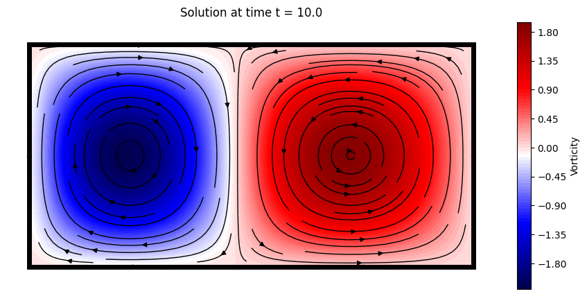
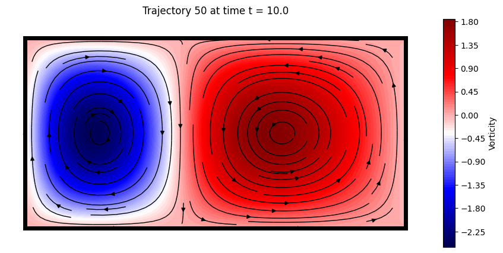
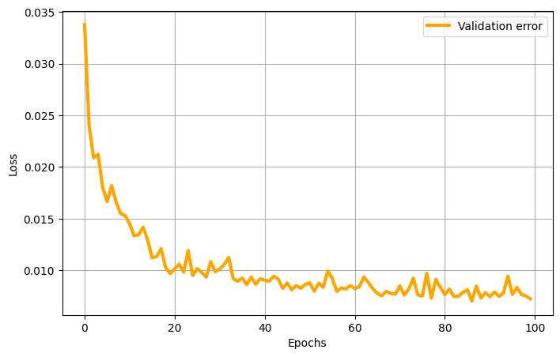
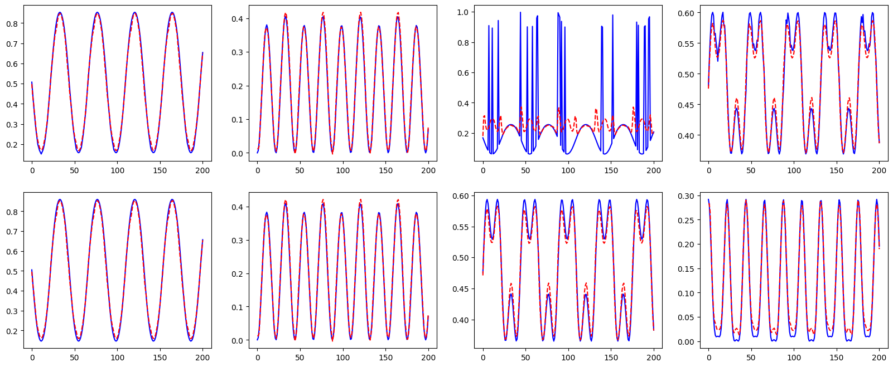
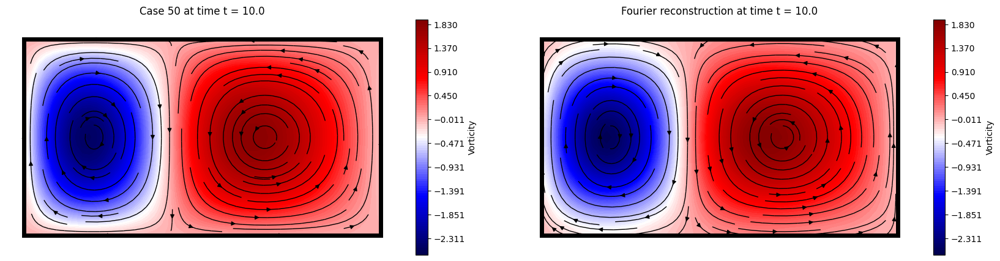
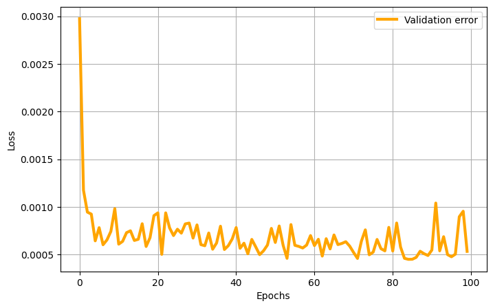
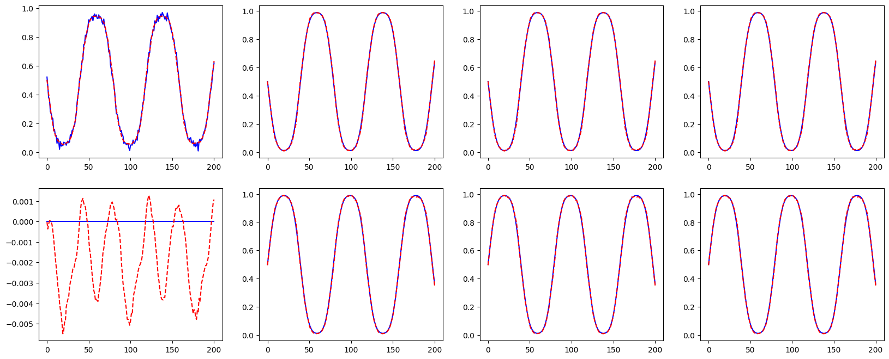
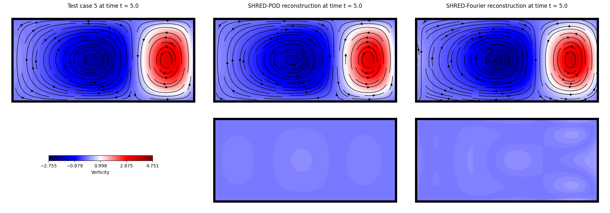

# SHRED-ROM Tutorial on Double Gyre Flow
**Authors:** Stefano Riva and Matteo Tomasetto

[](https://colab.research.google.com/drive/1MSmKFJPf0B81iAN2hjU-3IvFgimUBIc9)

The double gyre flow is a time-dependent model for two counter-rotating vortices (gyres) in a rectangular domain. When time is introduced via a periodic perturbation, the central dividing line between the two gyres oscillates left and right, creating a time-varying velocity field that can lead to chaotic particle trajectories. The velocity field $\mathbf{v} = [u, v]^T$ in the domain $[0, L_x] \times [0, L_y]$ and in the time interval $[0, T]$ is given by


$$
\begin{align}
u(x, y, t) &= -\pi I \sin\left( \pi f(x, t) \right) \cos\left( \pi y \right)
\\
v(x, y, t) &= \pi I \cos\left( \pi f(x, t) \right) \sin\left( \pi y \right) \frac{\partial f}{\partial x}
\end{align}
$$

\
where $I$ is the intensity parameter, $f(x, t) = \epsilon \sin(\omega t) x^2 + (1 - 2\epsilon \sin(\omega t)) x $, $\epsilon$ and $\omega$ are the perturbation amplitude and the frequency of the oscillation, respectively.


```python
%load_ext autoreload
%autoreload 2

# PYSHRED
from pyshred import DataManager, SHRED, SHREDEngine, LSTM_Forecaster

# IMPORT LIBRARIES
import torch
import numpy as np
import matplotlib.pyplot as plt
```

A function to compute the velocity components $u$ and $v$ is provided below.


```python
# DEFINE THE SYSTEM SOLVER

def double_gyre_flow(amplitude, frequency, x, y, t):
    '''
    Solve the double gyre flow problem

    Inputs
        amplitude                   (`float`)
        frequency                   (`float`)
        horizontal discretization   (`np.array[float]`, shape: (ny,))
        vertical discretization     (`np.array[float]`, shape: (nx,))
        time vector                 (`np.array[float]`, shape: (ntimes,))

    Output
        horizontal velocity matrix  (`np.array[float]`, shape: (ntimes, nx * ny)
        vertical velocity matrix    (`np.array[float]`, shape: (ntimes, nx * ny)
    '''

    xgrid, ygrid = np.meshgrid(x, y)         # spatial grid

    u = np.zeros((len(t), len(x), len(y)))   # horizontal velocity
    v = np.zeros((len(t), len(x), len(y)))   # vertical velocity

    intensity = 0.1   # intensity parameter

    f = lambda x,t: amplitude * np.sin(frequency * t) * x**2 + x - 2 * amplitude * np.sin(frequency * t) * x

    # compute solution
    for i in range(len(t)):
      u[i] = (-np.pi * intensity * np.sin(np.pi * f(xgrid, t[i])) * np.cos(np.pi * ygrid)).T
      v[i] = (np.pi * intensity * np.cos(np.pi * f(xgrid, t[i])) * np.sin(np.pi * ygrid) * (2 * amplitude * np.sin(frequency * t[i]) * xgrid + 1.0 - 2 * amplitude * np.sin(frequency * t[i]))).T

    return u, v
```

Let us look at an example of the double gyre flow with the following parameters:
- Amplitude $\epsilon = 0.25$
- Frequency $\omega = 5$


```python
# SOLVE THE SYSTEM FOR A FIXED TRANSPORT TERM

amplitude = 0.25    # amplitude
frequency = 5.0     # frequency

# spatial discretization
nx = 50
ny = 25
Lx = 2.0
Ly = 1.0
x = np.linspace(0, Lx, nx)
y = np.linspace(0, Ly, ny)
nstate = len(x) * len(y)

# temporal discretization
dt = 0.05
T = 10.0
t = np.arange(0, T + dt, dt)
ntimes = len(t)

u, v = double_gyre_flow(amplitude, frequency, x, y, t)
```

Let us plot the solution, in terms of the vorticity field $w = -\partial u / \partial y + \partial v / \partial x$


```python
# SOLUTION VISUALIZATION

from ipywidgets import interact, FloatSlider
import matplotlib.patches as patches

def vorticity(u, v):
    dx = Lx / nx
    dy = Ly / ny
    du_dy = np.gradient(u, dy, axis = 1)
    dv_dx = np.gradient(v, dx, axis = 0)
    return dv_dx - du_dy

def plot_solution(time):

    which_time = (np.abs(t - time)).argmin()
    offset = 0.1

    plt.figure(figsize = (10,5))
    cont = plt.contourf(x, y, vorticity(u[which_time], v[which_time]).T, cmap = 'seismic', levels = 100)
    plt.colorbar(cont, label='Vorticity', orientation='vertical', pad=0.04, aspect=20, fraction=0.05)
    plt.streamplot(x, y, u[which_time].T, v[which_time].T, color='black', linewidth = 1, density = 1)
    plt.axis('off')
    plt.axis([0 - offset, Lx + offset, 0 - offset, Ly + offset])
    plt.title(f'Solution at time t = {round(time, 3)}')
    plt.grid(True)
    plt.gca().add_patch(patches.Rectangle((0, 0), Lx, Ly, linewidth = 5, edgecolor = 'black', facecolor = 'none'))


# interact(plot_solution, time = FloatSlider(value = t[0], min = t[0], max = t[-1], step = (t[1]-t[0]), description='time', layout={'width': '400px', 'height': '50px'}))
plot_solution(t[-1])
```


    

    


Let us generate the snapshots by sampling the velocity field for parameters $\epsilon\in [0,0.5]$, $\omega \in [0.5, 2\pi]$ (randomly sampled).


```python
# DATA GENERATION

amplitude_range = np.array([0.0, 0.5])
frequency_range = np.array([0.5, 2*np.pi])

# spatial discretization
nx = 50
ny = 25
Lx = 2.0
Ly = 1.0
x = np.linspace(0, Lx, nx)
y = np.linspace(0, Ly, ny)
nstate = len(x) * len(y)

# temporal discretization
dt = 0.05
T = 10.0
t = np.arange(0, T + dt, dt)
ntimes = len(t)

# training data generation
ntrajectories = 100
U = np.zeros((ntrajectories, ntimes, nx, ny))
V = np.zeros((ntrajectories, ntimes, nx, ny))

parameters = np.zeros((ntrajectories, ntimes, 2))  # store amplitude and frequency

for i in range(ntrajectories):
  amplitude = (amplitude_range[1] - amplitude_range[0]) * np.random.rand() + amplitude_range[0]
  frequency = (frequency_range[1] - frequency_range[0]) * np.random.rand() + frequency_range[0]
  U[i], V[i] = double_gyre_flow(amplitude, frequency, x, y, t)

  parameters[i, :, 0] = amplitude
  parameters[i, :, 1] = frequency
```

Here a trajectory is visualized


```python
# DATA VISUALIZATION

from ipywidgets import interact, IntSlider

def plot_data(which_trajectory, which_time):

    offset = 0.1

    plt.figure(figsize = (10,5))
    cont = plt.contourf(x, y, vorticity(U[which_trajectory, which_time], V[which_trajectory, which_time]).T, cmap = 'seismic', levels = 100)
    plt.colorbar(cont, label='Vorticity', orientation='vertical', pad=0.04, aspect=20, fraction=0.05)
    plt.streamplot(x, y, U[which_trajectory, which_time].T, V[which_trajectory, which_time].T, color='black', linewidth = 1, density = 1)
    plt.axis('off')
    plt.axis([0 - offset, Lx + offset, 0 - offset, Ly + offset])
    plt.title(f'Trajectory {which_trajectory} at time t = {round(t[which_time], 3)}')
    plt.grid(True)
    plt.gca().add_patch(patches.Rectangle((0, 0), Lx, Ly, linewidth = 5, edgecolor = 'black', facecolor = 'none'))

# interact(plot_data, which_trajectory = IntSlider(min = 0, max = ntrajectories - 1, step = 1, description='Trajectory'), which_time = IntSlider(min = 0, max = ntimes - 1, step = 1, description='Time step'));
plot_data(50, -1)
```


    

    


## **SHallow REcurrent Decoder networks-based Reduced Order Modeling (SHRED-ROM)**

Let us assume to have three sensors in the domain measuring the horizontal velocity $u(x_s,y_s,t;\epsilon, \omega)$ over time. *SHRED-ROM* aims to reconstruct the temporal evolution of the entire velocity $\mathbf{v}(x,y,t;\epsilon, \omega) = [u(x,y,t;\epsilon, \omega), v(x,y,t;\epsilon, \omega)]^T$ starting from the limited sensor measurements available. In general, *SHRED-ROM* combines a recurrent neural network (LSTM), which encodes the temporal history of sensor values in multiple parametric regimes, and a shallow decoder, which projects the LSTM prediction to the (possibly high-dimensional) state dimension. Note that, to enhance computational efficiency and memory usage, dimensionality reduction strategies (such as, e.g., POD) may be considered to compress the training snapshots.

Two different compression strategies are available in this tutorial:
1. **POD**: Proper Orthogonal Decomposition, which computes the low-rank approximation of the training snapshots.
2. **Fourier**: Fourier decomposition, which computes the Fourier coefficients of the training snapshots.


```python
U = U.reshape(ntrajectories, ntimes, nstate)
V = V.reshape(ntrajectories, ntimes, nstate)
```

### POD-based compressive training
The `ParametricDataManager` is initialized


```python
from pyshred import ParametricDataManager, SHRED, ParametricSHREDEngine

# Initialize ParametricSHREDDataManager
manager_pod = ParametricDataManager(
    lags = 25,
    train_size = 0.8,
    val_size = 0.1,
    test_size = 0.1,
    )

import warnings
warnings.filterwarnings("ignore")
```

Let us add the different fields, the component $u$ is the one we want to reconstruct, while $v$ is indirectly reconstructed. The parameters $\epsilon$ and $\omega$ are included as output of the SHRED architecture.


```python
manager_pod.add_data(
    data=U,        # 3D array (parametric_trajectories, timesteps, field_dim)
    id="U",        # Unique identifier for the dataset
    random=3,      # Randomly select 3 sensor locations
    compress=4     # Spatial compression
)

## Since no random selection is specified for the second dataset, no measurement locations will be selected
manager_pod.add_data(
    data=V,         
    id="V",        
    compress=4     
)

## Add parameters to the manager
manager_pod.add_data(
    data=parameters,
    id='mu',
    compress=False,
)
```

If you want to add noise to the measurements (zero-mean Gaussian), it can added as follows:


```python
manager_pod.sensor_summary_df
```


<div>
<style scoped>
    .dataframe tbody tr th:only-of-type {
        vertical-align: middle;
    }

    .dataframe tbody tr th {
        vertical-align: top;
    }

    .dataframe thead th {
        text-align: right;
    }
</style>
<table border="1" class="dataframe">
  <thead>
    <tr style="text-align: right;">
      <th></th>
      <th>data id</th>
      <th>sensor_number</th>
      <th>type</th>
      <th>loc/traj</th>
    </tr>
  </thead>
  <tbody>
    <tr>
      <th>0</th>
      <td>U</td>
      <td>0</td>
      <td>stationary (random)</td>
      <td>(450,)</td>
    </tr>
    <tr>
      <th>1</th>
      <td>U</td>
      <td>1</td>
      <td>stationary (random)</td>
      <td>(696,)</td>
    </tr>
    <tr>
      <th>2</th>
      <td>U</td>
      <td>2</td>
      <td>stationary (random)</td>
      <td>(1119,)</td>
    </tr>
  </tbody>
</table>
</div>


```python
noise_std = 0.005
random_noise = np.random.normal(loc=0, scale=noise_std, size=manager_pod.sensor_measurements_df.shape)

manager_pod.sensor_measurements_df += random_noise
```

Let us prepare the data by splitting them into train, valid and test sets.


```python
train_dataset, val_dataset, test_dataset = manager_pod.prepare()
```

**Definition of the SHRED architecture**


```python
shred_pod = SHRED(
    sequence_model="LSTM",
    decoder_model="MLP",
    latent_forecaster=None
)
```

Let us fit the SHRED architecture


```python
val_errors_shredpod = shred_pod.fit(
    train_dataset=train_dataset,
    val_dataset=val_dataset,
    num_epochs=100,
    patience=50,
    verbose=True,
)
```

    Fitting SHRED...
    Epoch 1: Average training loss = 0.048769
    Validation MSE (epoch 1): 0.033769
    Epoch 2: Average training loss = 0.024560
    Validation MSE (epoch 2): 0.023983
    Epoch 3: Average training loss = 0.020259
    Validation MSE (epoch 3): 0.020888
    Epoch 4: Average training loss = 0.018009
    Validation MSE (epoch 4): 0.021217
    Epoch 5: Average training loss = 0.018030
    Validation MSE (epoch 5): 0.018037
    Epoch 6: Average training loss = 0.015617
    Validation MSE (epoch 6): 0.016645
    Epoch 7: Average training loss = 0.015672
    Validation MSE (epoch 7): 0.018195
    Epoch 8: Average training loss = 0.015270
    Validation MSE (epoch 8): 0.016599
    Epoch 9: Average training loss = 0.014198
    Validation MSE (epoch 9): 0.015475
    Epoch 10: Average training loss = 0.013217
    Validation MSE (epoch 10): 0.015304
    Epoch 11: Average training loss = 0.014081
    Validation MSE (epoch 11): 0.014519
    Epoch 12: Average training loss = 0.013127
    Validation MSE (epoch 12): 0.013332
    Epoch 13: Average training loss = 0.012611
    Validation MSE (epoch 13): 0.013455
    Epoch 14: Average training loss = 0.011910
    Validation MSE (epoch 14): 0.014167
    Epoch 15: Average training loss = 0.011451
    Validation MSE (epoch 15): 0.012931
    Epoch 16: Average training loss = 0.011435
    Validation MSE (epoch 16): 0.011200
    Epoch 17: Average training loss = 0.011174
    Validation MSE (epoch 17): 0.011342
    Epoch 18: Average training loss = 0.010193
    Validation MSE (epoch 18): 0.012082
    Epoch 19: Average training loss = 0.010594
    Validation MSE (epoch 19): 0.010255
    Epoch 20: Average training loss = 0.010028
    Validation MSE (epoch 20): 0.009681
    Epoch 21: Average training loss = 0.010194
    Validation MSE (epoch 21): 0.010145
    Epoch 22: Average training loss = 0.010055
    Validation MSE (epoch 22): 0.010590
    Epoch 23: Average training loss = 0.009914
    Validation MSE (epoch 23): 0.009824
    Epoch 24: Average training loss = 0.009833
    Validation MSE (epoch 24): 0.011903
    Epoch 25: Average training loss = 0.009926
    Validation MSE (epoch 25): 0.009502
    Epoch 26: Average training loss = 0.009452
    Validation MSE (epoch 26): 0.010169
    Epoch 27: Average training loss = 0.009565
    Validation MSE (epoch 27): 0.009790
    Epoch 28: Average training loss = 0.009618
    Validation MSE (epoch 28): 0.009341
    Epoch 29: Average training loss = 0.009510
    Validation MSE (epoch 29): 0.010851
    Epoch 30: Average training loss = 0.010536
    Validation MSE (epoch 30): 0.009865
    Epoch 31: Average training loss = 0.010857
    Validation MSE (epoch 31): 0.010132
    Epoch 32: Average training loss = 0.010034
    Validation MSE (epoch 32): 0.010550
    Epoch 33: Average training loss = 0.009805
    Validation MSE (epoch 33): 0.011249
    Epoch 34: Average training loss = 0.009578
    Validation MSE (epoch 34): 0.009207
    Epoch 35: Average training loss = 0.009322
    Validation MSE (epoch 35): 0.008932
    Epoch 36: Average training loss = 0.009408
    Validation MSE (epoch 36): 0.009249
    Epoch 37: Average training loss = 0.009532
    Validation MSE (epoch 37): 0.008605
    Epoch 38: Average training loss = 0.009032
    Validation MSE (epoch 38): 0.009340
    Epoch 39: Average training loss = 0.009478
    Validation MSE (epoch 39): 0.008643
    Epoch 40: Average training loss = 0.009637
    Validation MSE (epoch 40): 0.009194
    Epoch 41: Average training loss = 0.008968
    Validation MSE (epoch 41): 0.009029
    Epoch 42: Average training loss = 0.009313
    Validation MSE (epoch 42): 0.008953
    Epoch 43: Average training loss = 0.008661
    Validation MSE (epoch 43): 0.009417
    Epoch 44: Average training loss = 0.008871
    Validation MSE (epoch 44): 0.009143
    Epoch 45: Average training loss = 0.008713
    Validation MSE (epoch 45): 0.008243
    Epoch 46: Average training loss = 0.008516
    Validation MSE (epoch 46): 0.008760
    Epoch 47: Average training loss = 0.008852
    Validation MSE (epoch 47): 0.008106
    Epoch 48: Average training loss = 0.008991
    Validation MSE (epoch 48): 0.008523
    Epoch 49: Average training loss = 0.009202
    Validation MSE (epoch 49): 0.008260
    Epoch 50: Average training loss = 0.008984
    Validation MSE (epoch 50): 0.008638
    Epoch 51: Average training loss = 0.008913
    Validation MSE (epoch 51): 0.008798
    Epoch 52: Average training loss = 0.008750
    Validation MSE (epoch 52): 0.007973
    Epoch 53: Average training loss = 0.008583
    Validation MSE (epoch 53): 0.008755
    Epoch 54: Average training loss = 0.008643
    Validation MSE (epoch 54): 0.008356
    Epoch 55: Average training loss = 0.008989
    Validation MSE (epoch 55): 0.009911
    Epoch 56: Average training loss = 0.008911
    Validation MSE (epoch 56): 0.009242
    Epoch 57: Average training loss = 0.009598
    Validation MSE (epoch 57): 0.007947
    Epoch 58: Average training loss = 0.008771
    Validation MSE (epoch 58): 0.008283
    Epoch 59: Average training loss = 0.008395
    Validation MSE (epoch 59): 0.008188
    Epoch 60: Average training loss = 0.008311
    Validation MSE (epoch 60): 0.008512
    Epoch 61: Average training loss = 0.008956
    Validation MSE (epoch 61): 0.008251
    Epoch 62: Average training loss = 0.008933
    Validation MSE (epoch 62): 0.008402
    Epoch 63: Average training loss = 0.008697
    Validation MSE (epoch 63): 0.009362
    Epoch 64: Average training loss = 0.009346
    Validation MSE (epoch 64): 0.008823
    Epoch 65: Average training loss = 0.008487
    Validation MSE (epoch 65): 0.008223
    Epoch 66: Average training loss = 0.008970
    Validation MSE (epoch 66): 0.007755
    Epoch 67: Average training loss = 0.008109
    Validation MSE (epoch 67): 0.007536
    Epoch 68: Average training loss = 0.008115
    Validation MSE (epoch 68): 0.007968
    Epoch 69: Average training loss = 0.008414
    Validation MSE (epoch 69): 0.007755
    Epoch 70: Average training loss = 0.008343
    Validation MSE (epoch 70): 0.007679
    Epoch 71: Average training loss = 0.008369
    Validation MSE (epoch 71): 0.008491
    Epoch 72: Average training loss = 0.008931
    Validation MSE (epoch 72): 0.007601
    Epoch 73: Average training loss = 0.008175
    Validation MSE (epoch 73): 0.008197
    Epoch 74: Average training loss = 0.008743
    Validation MSE (epoch 74): 0.009242
    Epoch 75: Average training loss = 0.008629
    Validation MSE (epoch 75): 0.007614
    Epoch 76: Average training loss = 0.008238
    Validation MSE (epoch 76): 0.007511
    Epoch 77: Average training loss = 0.008608
    Validation MSE (epoch 77): 0.009713
    Epoch 78: Average training loss = 0.009083
    Validation MSE (epoch 78): 0.007302
    Epoch 79: Average training loss = 0.008555
    Validation MSE (epoch 79): 0.009131
    Epoch 80: Average training loss = 0.008692
    Validation MSE (epoch 80): 0.008350
    Epoch 81: Average training loss = 0.008351
    Validation MSE (epoch 81): 0.007651
    Epoch 82: Average training loss = 0.008126
    Validation MSE (epoch 82): 0.008180
    Epoch 83: Average training loss = 0.008174
    Validation MSE (epoch 83): 0.007459
    Epoch 84: Average training loss = 0.008057
    Validation MSE (epoch 84): 0.007481
    Epoch 85: Average training loss = 0.008541
    Validation MSE (epoch 85): 0.007852
    Epoch 86: Average training loss = 0.008556
    Validation MSE (epoch 86): 0.008122
    Epoch 87: Average training loss = 0.008124
    Validation MSE (epoch 87): 0.007018
    Epoch 88: Average training loss = 0.007865
    Validation MSE (epoch 88): 0.008479
    Epoch 89: Average training loss = 0.008558
    Validation MSE (epoch 89): 0.007316
    Epoch 90: Average training loss = 0.007718
    Validation MSE (epoch 90): 0.007830
    Epoch 91: Average training loss = 0.008219
    Validation MSE (epoch 91): 0.007448
    Epoch 92: Average training loss = 0.008254
    Validation MSE (epoch 92): 0.007891
    Epoch 93: Average training loss = 0.008132
    Validation MSE (epoch 93): 0.007479
    Epoch 94: Average training loss = 0.007933
    Validation MSE (epoch 94): 0.007772
    Epoch 95: Average training loss = 0.008519
    Validation MSE (epoch 95): 0.009434
    Epoch 96: Average training loss = 0.008763
    Validation MSE (epoch 96): 0.007659
    Epoch 97: Average training loss = 0.008736
    Validation MSE (epoch 97): 0.008347
    Epoch 98: Average training loss = 0.009099
    Validation MSE (epoch 98): 0.007656
    Epoch 99: Average training loss = 0.008044
    Validation MSE (epoch 99): 0.007515
    Epoch 100: Average training loss = 0.007707
    Validation MSE (epoch 100): 0.007233
    

Here the validation loss is plotted


```python
plt.figure(figsize = (8,5))
plt.plot(val_errors_shredpod, 'orange', linewidth = 3, label = 'Validation error')
plt.xlabel('Epochs')
plt.ylabel('Loss')
plt.legend()
plt.grid(True)
```


    

    


Let us evaluate the SHRED model on the different sets


```python
print(f"Train MSE: {shred_pod.evaluate(dataset=train_dataset):.3f}")
print(f"Val   MSE: {shred_pod.evaluate(dataset=val_dataset):.3f}")
print(f"Test  MSE: {shred_pod.evaluate(dataset=test_dataset):.3f}")
```

    Train MSE: 0.007
    Val   MSE: 0.007
    Test  MSE: 0.007
    

Let us check the reconstruction of the POD coefficients


```python
which_param = 0  # Index of the parameter to visualize

fig, axs = plt.subplots(2, 4, figsize=(20, 8))

for i in range(4):
    axs[0, i].plot(test_dataset.Y[ntimes * which_param:ntimes * (which_param + 1), i].cpu().numpy(), 'b', label='True U')
    axs[0, i].plot(shred_pod(test_dataset.X)[ntimes * which_param:ntimes * (which_param + 1), i].cpu().detach().numpy(), 'r--', label='True U')

    axs[1, i].plot(test_dataset.Y[ntimes * which_param:ntimes * (which_param + 1), i + 4].cpu().numpy(), 'b', label='True V')
    axs[1, i].plot(shred_pod(test_dataset.X)[ntimes * which_param:ntimes * (which_param + 1), i + 4].cpu().detach().numpy(), 'r--', label='True V')
```


    

    


Let us check the reconstruction of the double gyre flow

### Fourier-based compressive training


```python
freq_cutoff = 0.05

freq_x = np.fft.fftfreq(nx)
freq_y = np.fft.fftfreq(ny)
freq_x_grid, freq_y_grid = np.meshgrid(freq_x, freq_y)
mask_x = np.abs(freq_x_grid.T) <= freq_cutoff

# Transform the data to frequency domain - U
U_fft = np.fft.fft2(U.reshape(ntrajectories, ntimes, nx, ny), axes = (-2, -1))
U_fft[:,:,~mask_x] = 0
U_proj = U_fft[:,:,mask_x]
U_proj_real = np.real(U_proj)
U_proj_imag = np.imag(U_proj)

Fourier_modes_x = U_proj.shape[-1]

# Transform the data to frequency domain - V
mask_y = np.abs(freq_y_grid.T) <= freq_cutoff
V_fft = np.fft.fft2(V.reshape(ntrajectories, ntimes, nx, ny), axes = (-2, -1))
V_fft[:,:,~mask_y] = 0
V_proj = V_fft[:,:,mask_y]
V_proj_real = np.real(V_proj)
V_proj_imag = np.imag(V_proj)

Fourier_modes_y = V_proj.shape[-1]
```

Let us plot the projected and reconstructed velocity fields


```python
U_recons = np.fft.ifft2(U_fft).real
V_recons = np.fft.ifft2(V_fft).real

def plot_fourier_data(which_test_trajectory, which_time):

    offset = 0.1

    _min = vorticity(U[which_test_trajectory, which_time].reshape(nx, ny),  V[which_test_trajectory, which_time].reshape(nx, ny)).min()
    _max = vorticity(U[which_test_trajectory, which_time].reshape(nx, ny),  V[which_test_trajectory, which_time].reshape(nx, ny)).max()

    levels = np.linspace(_min, _max, 100) * 1.05

    plt.figure(figsize = (20,5))
    plt.subplot(1, 2, 1)
    cont = plt.contourf(x, y, vorticity(U[which_test_trajectory, which_time].reshape(nx, ny),  V[which_test_trajectory, which_time].reshape(nx, ny)).T, cmap = 'seismic', levels = levels)
    plt.streamplot(x, y, U[which_test_trajectory, which_time].reshape(nx, ny).T, V[which_test_trajectory, which_time].reshape(nx, ny).T, color='black', linewidth = 1, density = 1)
    plt.axis('off')
    plt.axis([0 - offset, Lx + offset, 0 - offset, Ly + offset])
    plt.title(f'Case {which_test_trajectory} at time t = {round(t[which_time], 3)}')
    plt.grid(True)
    plt.gca().add_patch(patches.Rectangle((0, 0), Lx, Ly, linewidth = 5, edgecolor = 'black', facecolor = 'none'))
    plt.colorbar(cont, label='Vorticity', orientation='vertical', pad=0.04, aspect=20, fraction=0.05)

    plt.subplot(1, 2, 2)
    cont = plt.contourf(x, y, vorticity(U_recons[which_test_trajectory, which_time].reshape(nx, ny),  V_recons[which_test_trajectory, which_time].reshape(nx, ny)).T, cmap = 'seismic', levels = levels)
    plt.streamplot(x, y, U_recons[which_test_trajectory, which_time].reshape(nx, ny).T, V_recons[which_test_trajectory, which_time].reshape(nx, ny).T, color='black', linewidth = 1, density = 1)
    plt.axis('off')
    plt.axis([0 - offset, Lx + offset, 0 - offset, Ly + offset])
    plt.title(f'Fourier reconstruction at time t = {round(t[which_time], 3)}')
    plt.grid(True)
    plt.gca().add_patch(patches.Rectangle((0, 0), Lx, Ly, linewidth = 5, edgecolor = 'black', facecolor = 'none'))
    plt.colorbar(cont, label='Vorticity', orientation='vertical', pad=0.04, aspect=20, fraction=0.05)

# interact(plot_fourier_data, which_test_trajectory = IntSlider(min = 0, max = ntrajectories - 1, step = 1, description='Test case'), which_time = IntSlider(min = 0, max = ntimes - 1, step = 1, description='Time step'));

plot_fourier_data(50, -1)
```


    

    


Let us compute the measurement field from $u$ using the same input positions as before


```python
sens_locs = [manager_pod.sensor_summary_df['loc/traj'][i][0] for i in range(len(manager_pod.sensor_summary_df))]

measurements = U[:, :, sens_locs]

# Add noise to the measurements
measurements += np.random.normal(loc=0, scale=noise_std, size=measurements.shape)
```

Let us initialize the `ParametricDataManager` for Fourier-based training


```python
manager_fourier = ParametricDataManager(
    lags = 25,
    train_size = 0.8,
    val_size = 0.1,
    test_size = 0.1
)
```

Let us add the different fields, the component $u$ is the one we want to reconstruct, while $v$ is indirectly reconstructed. The parameters $\epsilon$ and $\omega$ are included as output of the SHRED architecture.


```python
# Real and imaginary parts have to be added separately
manager_fourier.add_data(
    data=U_proj_real,        
    id="Ufft_real",        
    measurements=measurements,  # Use the measurements with noise already computed
    compress=False
)

manager_fourier.add_data(
    data=U_proj_imag,        
    id="Ufft_imag",        
    compress=False
)

# Add the second dataset (V) in the same way
manager_fourier.add_data(
    data=V_proj_real,        
    id="Vfft_real",        
    compress=False
)

manager_fourier.add_data(
    data=V_proj_imag,        
    id="Vfft_imag",        
    compress=False
)

## Add parameters to the manager
manager_fourier.add_data(
    data=parameters,
    id='mu',
    compress=False,
)
```

Let us prepare the data by splitting them into train, valid and test sets.


```python
train_dataset, val_dataset, test_dataset= manager_fourier.prepare()
```

**Definition of the SHRED architecture**


```python
shred_fourier = SHRED(
    sequence_model="LSTM",
    decoder_model="MLP",
    latent_forecaster=None
)
```

Let us fit the SHRED architecture


```python
val_errors_shredfourier = shred_fourier.fit(
    train_dataset=train_dataset,
    val_dataset=val_dataset,
    num_epochs=100,
    patience=50,
    verbose=True,
)
```

    Fitting SHRED...
    Epoch 1: Average training loss = 0.044613
    Validation MSE (epoch 1): 0.002973
    Epoch 2: Average training loss = 0.003913
    Validation MSE (epoch 2): 0.001174
    Epoch 3: Average training loss = 0.002434
    Validation MSE (epoch 3): 0.000945
    Epoch 4: Average training loss = 0.001967
    Validation MSE (epoch 4): 0.000924
    Epoch 5: Average training loss = 0.001585
    Validation MSE (epoch 5): 0.000644
    Epoch 6: Average training loss = 0.001420
    Validation MSE (epoch 6): 0.000782
    Epoch 7: Average training loss = 0.001382
    Validation MSE (epoch 7): 0.000603
    Epoch 8: Average training loss = 0.001323
    Validation MSE (epoch 8): 0.000653
    Epoch 9: Average training loss = 0.001344
    Validation MSE (epoch 9): 0.000743
    Epoch 10: Average training loss = 0.001090
    Validation MSE (epoch 10): 0.000981
    Epoch 11: Average training loss = 0.001128
    Validation MSE (epoch 11): 0.000609
    Epoch 12: Average training loss = 0.000906
    Validation MSE (epoch 12): 0.000638
    Epoch 13: Average training loss = 0.000987
    Validation MSE (epoch 13): 0.000729
    Epoch 14: Average training loss = 0.000925
    Validation MSE (epoch 14): 0.000749
    Epoch 15: Average training loss = 0.000925
    Validation MSE (epoch 15): 0.000648
    Epoch 16: Average training loss = 0.000901
    Validation MSE (epoch 16): 0.000660
    Epoch 17: Average training loss = 0.000935
    Validation MSE (epoch 17): 0.000823
    Epoch 18: Average training loss = 0.000879
    Validation MSE (epoch 18): 0.000584
    Epoch 19: Average training loss = 0.001090
    Validation MSE (epoch 19): 0.000677
    Epoch 20: Average training loss = 0.000895
    Validation MSE (epoch 20): 0.000908
    Epoch 21: Average training loss = 0.000846
    Validation MSE (epoch 21): 0.000937
    Epoch 22: Average training loss = 0.000871
    Validation MSE (epoch 22): 0.000502
    Epoch 23: Average training loss = 0.000842
    Validation MSE (epoch 23): 0.000937
    Epoch 24: Average training loss = 0.000933
    Validation MSE (epoch 24): 0.000779
    Epoch 25: Average training loss = 0.000731
    Validation MSE (epoch 25): 0.000699
    Epoch 26: Average training loss = 0.000782
    Validation MSE (epoch 26): 0.000766
    Epoch 27: Average training loss = 0.000845
    Validation MSE (epoch 27): 0.000724
    Epoch 28: Average training loss = 0.000795
    Validation MSE (epoch 28): 0.000821
    Epoch 29: Average training loss = 0.000805
    Validation MSE (epoch 29): 0.000830
    Epoch 30: Average training loss = 0.000775
    Validation MSE (epoch 30): 0.000672
    Epoch 31: Average training loss = 0.000700
    Validation MSE (epoch 31): 0.000811
    Epoch 32: Average training loss = 0.000781
    Validation MSE (epoch 32): 0.000604
    Epoch 33: Average training loss = 0.000729
    Validation MSE (epoch 33): 0.000592
    Epoch 34: Average training loss = 0.000724
    Validation MSE (epoch 34): 0.000726
    Epoch 35: Average training loss = 0.000898
    Validation MSE (epoch 35): 0.000556
    Epoch 36: Average training loss = 0.000732
    Validation MSE (epoch 36): 0.000621
    Epoch 37: Average training loss = 0.000834
    Validation MSE (epoch 37): 0.000797
    Epoch 38: Average training loss = 0.000686
    Validation MSE (epoch 38): 0.000553
    Epoch 39: Average training loss = 0.000686
    Validation MSE (epoch 39): 0.000593
    Epoch 40: Average training loss = 0.000749
    Validation MSE (epoch 40): 0.000664
    Epoch 41: Average training loss = 0.000767
    Validation MSE (epoch 41): 0.000783
    Epoch 42: Average training loss = 0.000819
    Validation MSE (epoch 42): 0.000565
    Epoch 43: Average training loss = 0.000788
    Validation MSE (epoch 43): 0.000619
    Epoch 44: Average training loss = 0.000685
    Validation MSE (epoch 44): 0.000508
    Epoch 45: Average training loss = 0.000792
    Validation MSE (epoch 45): 0.000659
    Epoch 46: Average training loss = 0.000610
    Validation MSE (epoch 46): 0.000580
    Epoch 47: Average training loss = 0.000692
    Validation MSE (epoch 47): 0.000499
    Epoch 48: Average training loss = 0.000657
    Validation MSE (epoch 48): 0.000539
    Epoch 49: Average training loss = 0.000655
    Validation MSE (epoch 49): 0.000600
    Epoch 50: Average training loss = 0.000813
    Validation MSE (epoch 50): 0.000774
    Epoch 51: Average training loss = 0.000659
    Validation MSE (epoch 51): 0.000626
    Epoch 52: Average training loss = 0.000694
    Validation MSE (epoch 52): 0.000799
    Epoch 53: Average training loss = 0.000672
    Validation MSE (epoch 53): 0.000598
    Epoch 54: Average training loss = 0.000642
    Validation MSE (epoch 54): 0.000460
    Epoch 55: Average training loss = 0.000656
    Validation MSE (epoch 55): 0.000814
    Epoch 56: Average training loss = 0.000635
    Validation MSE (epoch 56): 0.000597
    Epoch 57: Average training loss = 0.000647
    Validation MSE (epoch 57): 0.000585
    Epoch 58: Average training loss = 0.000701
    Validation MSE (epoch 58): 0.000568
    Epoch 59: Average training loss = 0.000583
    Validation MSE (epoch 59): 0.000599
    Epoch 60: Average training loss = 0.000724
    Validation MSE (epoch 60): 0.000699
    Epoch 61: Average training loss = 0.000813
    Validation MSE (epoch 61): 0.000594
    Epoch 62: Average training loss = 0.000617
    Validation MSE (epoch 62): 0.000660
    Epoch 63: Average training loss = 0.000710
    Validation MSE (epoch 63): 0.000484
    Epoch 64: Average training loss = 0.000600
    Validation MSE (epoch 64): 0.000666
    Epoch 65: Average training loss = 0.000634
    Validation MSE (epoch 65): 0.000559
    Epoch 66: Average training loss = 0.000702
    Validation MSE (epoch 66): 0.000705
    Epoch 67: Average training loss = 0.000643
    Validation MSE (epoch 67): 0.000604
    Epoch 68: Average training loss = 0.000633
    Validation MSE (epoch 68): 0.000616
    Epoch 69: Average training loss = 0.000706
    Validation MSE (epoch 69): 0.000635
    Epoch 70: Average training loss = 0.000687
    Validation MSE (epoch 70): 0.000589
    Epoch 71: Average training loss = 0.000599
    Validation MSE (epoch 71): 0.000522
    Epoch 72: Average training loss = 0.000560
    Validation MSE (epoch 72): 0.000459
    Epoch 73: Average training loss = 0.000608
    Validation MSE (epoch 73): 0.000640
    Epoch 74: Average training loss = 0.000704
    Validation MSE (epoch 74): 0.000759
    Epoch 75: Average training loss = 0.000736
    Validation MSE (epoch 75): 0.000497
    Epoch 76: Average training loss = 0.000740
    Validation MSE (epoch 76): 0.000525
    Epoch 77: Average training loss = 0.000518
    Validation MSE (epoch 77): 0.000658
    Epoch 78: Average training loss = 0.000582
    Validation MSE (epoch 78): 0.000561
    Epoch 79: Average training loss = 0.000732
    Validation MSE (epoch 79): 0.000538
    Epoch 80: Average training loss = 0.000575
    Validation MSE (epoch 80): 0.000785
    Epoch 81: Average training loss = 0.000730
    Validation MSE (epoch 81): 0.000537
    Epoch 82: Average training loss = 0.000629
    Validation MSE (epoch 82): 0.000830
    Epoch 83: Average training loss = 0.000953
    Validation MSE (epoch 83): 0.000578
    Epoch 84: Average training loss = 0.000577
    Validation MSE (epoch 84): 0.000460
    Epoch 85: Average training loss = 0.000554
    Validation MSE (epoch 85): 0.000450
    Epoch 86: Average training loss = 0.000480
    Validation MSE (epoch 86): 0.000451
    Epoch 87: Average training loss = 0.000559
    Validation MSE (epoch 87): 0.000470
    Epoch 88: Average training loss = 0.000524
    Validation MSE (epoch 88): 0.000534
    Epoch 89: Average training loss = 0.000720
    Validation MSE (epoch 89): 0.000509
    Epoch 90: Average training loss = 0.000691
    Validation MSE (epoch 90): 0.000490
    Epoch 91: Average training loss = 0.000882
    Validation MSE (epoch 91): 0.000547
    Epoch 92: Average training loss = 0.000548
    Validation MSE (epoch 92): 0.001040
    Epoch 93: Average training loss = 0.000475
    Validation MSE (epoch 93): 0.000539
    Epoch 94: Average training loss = 0.000855
    Validation MSE (epoch 94): 0.000687
    Epoch 95: Average training loss = 0.000781
    Validation MSE (epoch 95): 0.000499
    Epoch 96: Average training loss = 0.000515
    Validation MSE (epoch 96): 0.000477
    Epoch 97: Average training loss = 0.000489
    Validation MSE (epoch 97): 0.000504
    Epoch 98: Average training loss = 0.000588
    Validation MSE (epoch 98): 0.000896
    Epoch 99: Average training loss = 0.000825
    Validation MSE (epoch 99): 0.000954
    Epoch 100: Average training loss = 0.000549
    Validation MSE (epoch 100): 0.000533
    

Here the validation loss is plotted


```python
plt.figure(figsize = (8,5))
plt.plot(val_errors_shredfourier, 'orange', linewidth = 3, label = 'Validation error')
plt.xlabel('Epochs')
plt.ylabel('Loss')
plt.legend()
plt.grid(True)
```


    

    


Let us evaluate the SHRED model on the different sets


```python
print(f"Train MSE: {shred_fourier.evaluate(dataset=train_dataset):.5f}")
print(f"Val   MSE: {shred_fourier.evaluate(dataset=val_dataset):.5f}")
print(f"Test  MSE: {shred_fourier.evaluate(dataset=test_dataset):.5f}")
```

    Train MSE: 0.00040
    Val   MSE: 0.00053
    Test  MSE: 0.00039
    

Let us check the reconstruction of the Fourier coefficients


```python
which_param = 5  # Index of the parameter to visualize

fig, axs = plt.subplots(2, 4, figsize=(20, 8))

for i in range(4):
    axs[0, i].plot(test_dataset.Y[ntimes * which_param:ntimes * (which_param + 1), i].cpu().numpy(), 'b', label='True U')
    axs[0, i].plot(shred_fourier(test_dataset.X)[ntimes * which_param:ntimes * (which_param + 1), i].cpu().detach().numpy(), 'r--', label='True U')

    axs[1, i].plot(test_dataset.Y[ntimes * which_param:ntimes * (which_param + 1), i + 125].cpu().numpy(), 'b', label='True V')
    axs[1, i].plot(shred_fourier(test_dataset.X)[ntimes * which_param:ntimes * (which_param + 1), i + 125].cpu().detach().numpy(), 'r--', label='True V')
```


    

    


### Comparison of POD and Fourier-based training

Let us define the different engines for evaluations


```python
engine_pod = ParametricSHREDEngine(manager_pod, shred_pod)
engine_fourier = ParametricSHREDEngine(manager_fourier, shred_fourier)
```

Let us compute the different output of each SHRED model:
- POD-based is directly embedded in the SHRED model, thus the output is the reconstructed fields
- Fourier-based is not directly embedded in the SHRED model, thus the output is the Fourier coefficients of the reconstructed fields


```python
ntest = manager_fourier.test_indices.shape[0]

Utest = U[manager_pod.test_indices] # assumed that fourier and pod test indices are the same
Vtest = V[manager_pod.test_indices] # assumed that fourier and pod test indices are the same

# POD
pod_test_reconstruction = engine_pod.decode(engine_pod.sensor_to_latent(manager_pod.test_sensor_measurements))
pod_test_reconstruction['U'] = pod_test_reconstruction['U'].reshape(ntest, ntimes, -1)
pod_test_reconstruction['V'] = pod_test_reconstruction['V'].reshape(ntest, ntimes, -1)

# Fourier
fourier_coeffs_test_reconstruction = engine_fourier.decode(engine_fourier.sensor_to_latent(manager_fourier.test_sensor_measurements))

def fourier_to_rec(fourier_coeff, mask):
    _proj_hat = fourier_coeff.reshape(ntest, ntimes, -1)

    _fft_hat = np.zeros((ntest, ntimes, nx, ny), dtype=np.complex128)
    _fft_hat[:,:,mask] = _proj_hat

    return np.fft.ifft2(_fft_hat).real

fourier_test_reconstrucion = dict()
fourier_test_reconstrucion['U'] = fourier_to_rec(fourier_coeffs_test_reconstruction['Ufft_real'] + 1j * fourier_coeffs_test_reconstruction['Ufft_imag'], mask_x).reshape(ntest, ntimes, -1)
fourier_test_reconstrucion['V'] = fourier_to_rec(fourier_coeffs_test_reconstruction['Vfft_real'] + 1j * fourier_coeffs_test_reconstruction['Vfft_imag'], mask_y).reshape(ntest, ntimes, -1)
fourier_test_reconstrucion['mu'] = fourier_coeffs_test_reconstruction['mu'].reshape(ntest, ntimes, -1)
```

Let us reshape all the outputs to be compatible with the plotting functions


```python
Utest = Utest.reshape(ntest, ntimes, nx, ny)
Vtest = Vtest.reshape(ntest, ntimes, nx, ny)

# POD 
pod_test_reconstruction['U'] = pod_test_reconstruction['U'].reshape(ntest, ntimes, nx, ny)
pod_test_reconstruction['V'] = pod_test_reconstruction['V'].reshape(ntest, ntimes, nx, ny)

# Fourier
fourier_test_reconstrucion['U'] = fourier_test_reconstrucion['U'].reshape(ntest, ntimes, nx, ny)
fourier_test_reconstrucion['V'] = fourier_test_reconstrucion['V'].reshape(ntest, ntimes, nx, ny)
```

Let us plot the reconstructed fields for both POD and Fourier-based training


```python
def plot_shred_reconstruction(which_test_trajectory, which_time):

    offset = 0.1

    fig, axs = plt.subplots(2, 3, figsize=(8*3, 8))

    levels = np.linspace(vorticity(Utest[which_test_trajectory, which_time],  Vtest[which_test_trajectory, which_time]).min(),
                         vorticity(Utest[which_test_trajectory, which_time],  Vtest[which_test_trajectory, which_time]).max(),
                         100) * 1.4

    cont = axs[0,0].contourf(x,y, vorticity(Utest[which_test_trajectory, which_time],  Vtest[which_test_trajectory, which_time]).T, cmap = 'seismic', levels = levels)
    axs[0,0].streamplot(x, y, Utest[which_test_trajectory, which_time].T, Vtest[which_test_trajectory, which_time].T, color='black', linewidth = 1, density = 1)

    axs[0,1].contourf(x, y, vorticity(pod_test_reconstruction['U'][which_test_trajectory, which_time], pod_test_reconstruction['V'][which_test_trajectory, which_time]).T, cmap = 'seismic', levels = levels)
    axs[0,1].streamplot(x, y, pod_test_reconstruction['U'][which_test_trajectory, which_time].T, pod_test_reconstruction['V'][which_test_trajectory, which_time].T, color='black', linewidth = 1, density = 1)

    axs[0,2].contourf(x, y, vorticity(fourier_test_reconstrucion['U'][which_test_trajectory, which_time], fourier_test_reconstrucion['V'][which_test_trajectory, which_time]).T, cmap = 'seismic', levels = levels)
    axs[0,2].streamplot(x, y, fourier_test_reconstrucion['U'][which_test_trajectory, which_time].T, fourier_test_reconstrucion['V'][which_test_trajectory, which_time].T, color='black', linewidth = 1, density = 1)

    for ax in axs[0]:
        ax.axis('off')
        ax.axis([0 - offset, Lx + offset, 0 - offset, Ly + offset])
        ax.grid()
        ax.add_patch(patches.Rectangle((0, 0), Lx, Ly, linewidth = 5, edgecolor = 'black', facecolor = 'none'))
    cbar = fig.colorbar(cont, ax=axs[1,0], label='Vorticity', orientation='horizontal', pad=0.04, aspect=20, fraction=0.05)
    cbar.ax.set_xticks(np.linspace(levels.min(), levels.max(), 5))

    axs[1,0].axis('off')
    axs[1,1].contourf(x, y, np.abs(vorticity(pod_test_reconstruction['U'][which_test_trajectory, which_time], pod_test_reconstruction['V'][which_test_trajectory, which_time]).T -
                                   vorticity(Utest[which_test_trajectory, which_time],  Vtest[which_test_trajectory, which_time]).T), cmap='seismic', levels=levels)

    axs[1,2].contourf(x, y, np.abs(vorticity(fourier_test_reconstrucion['U'][which_test_trajectory, which_time], fourier_test_reconstrucion['V'][which_test_trajectory, which_time]).T -
                                   vorticity(Utest[which_test_trajectory, which_time],  Vtest[which_test_trajectory, which_time]).T), cmap='seismic', levels=levels)

    axs[1,1].axis('off')
    axs[1,2].axis('off')
    axs[1,1].add_patch(patches.Rectangle((0, 0), Lx, Ly, linewidth = 5, edgecolor = 'black', facecolor = 'none'))
    axs[1,2].add_patch(patches.Rectangle((0, 0), Lx, Ly, linewidth = 5, edgecolor = 'black', facecolor = 'none'))
    axs[1,1].axis([0 - offset, Lx + offset, 0 - offset, Ly + offset])
    axs[1,2].axis([0 - offset, Lx + offset, 0 - offset, Ly + offset])

    axs[0, 0].set_title(f'Test case {which_test_trajectory} at time t = {round(t[which_time], 3)}')
    axs[0, 1].set_title(f'SHRED-POD reconstruction at time t = {round(t[which_time], 3)}')
    axs[0, 2].set_title(f'SHRED-Fourier reconstruction at time t = {round(t[which_time], 3)}')

    fig.subplots_adjust(wspace=0.01, hspace=0.01)
    cbar.ax.set_position([0.15, 0.3, 0.2, 0.02])

# interact(plot_shred_reconstruction, which_test_trajectory = IntSlider(value = 0, min = 0, max = ntest - 1, description='Test case'), which_time = IntSlider(min = 0, max = ntimes - 1, step = 1, description='Time step'));
plot_shred_reconstruction(5, 100)
```


    

    

