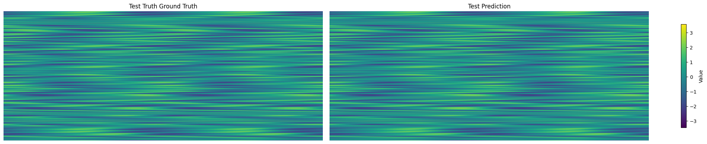

# SHRED-ROM Tutorial on Kuramoto Sivashinsky

[](https://colab.research.google.com/drive/1eFR-3l6qFgo3360V2LrJqBPSLheI4Mfd)

#### Import Libraries


```python
# PYSHRED
%load_ext autoreload
%autoreload 2
from pyshred import ParametricDataManager, SHRED, ParametricSHREDEngine

# Other helper libraries
import matplotlib.pyplot as plt
from scipy.io import loadmat
import torch
import numpy as np
```

    The autoreload extension is already loaded. To reload it, use:
      %reload_ext autoreload
    

#### Load Kuramoto Sivashinsky dataset


```python
import numpy as np
import urllib.request
# URL of the NPZ file
url = 'https://zenodo.org/records/14524524/files/KuramotoSivashinsky_data.npz?download=1'
# Local filename to save the downloaded file
filename = 'KuramotoSivashinsky_data.npz'
# Download the file from the URL
urllib.request.urlretrieve(url, filename)
# Load the data from the NPZ file
dataset = np.load(filename)
```

#### Initialize Data Manager


```python
# Initialize ParametricSHREDDataManager
manager = ParametricDataManager(
    lags = 20,
    train_size = 0.8,
    val_size = 0.1,
    test_size = 0.1,
    )
```

#### Add datasets and sensors


```python
data = dataset['u'] # shape (500, 201, 100)

manager.add_data(
    data=data,
    random=3,
    # stationary=[(15,),(30,),(45,)],
    id = 'KS',
    compress = False
)
```

#### Analyze sensor summary


```python
manager.sensor_measurements_df
```


<div>
<style scoped>
    .dataframe tbody tr th:only-of-type {
        vertical-align: middle;
    }

    .dataframe tbody tr th {
        vertical-align: top;
    }

    .dataframe thead th {
        text-align: right;
    }
</style>
<table border="1" class="dataframe">
  <thead>
    <tr style="text-align: right;">
      <th></th>
      <th>KS-0</th>
      <th>KS-1</th>
      <th>KS-2</th>
    </tr>
  </thead>
  <tbody>
    <tr>
      <th>0</th>
      <td>0.047727</td>
      <td>0.553612</td>
      <td>-0.954329</td>
    </tr>
    <tr>
      <th>1</th>
      <td>0.067329</td>
      <td>0.695523</td>
      <td>-0.849845</td>
    </tr>
    <tr>
      <th>2</th>
      <td>0.014021</td>
      <td>0.630202</td>
      <td>-0.823280</td>
    </tr>
    <tr>
      <th>3</th>
      <td>-0.031031</td>
      <td>0.515125</td>
      <td>-0.789117</td>
    </tr>
    <tr>
      <th>4</th>
      <td>-0.063776</td>
      <td>0.346338</td>
      <td>-0.763155</td>
    </tr>
    <tr>
      <th>...</th>
      <td>...</td>
      <td>...</td>
      <td>...</td>
    </tr>
    <tr>
      <th>100495</th>
      <td>-0.039383</td>
      <td>1.815631</td>
      <td>-1.450543</td>
    </tr>
    <tr>
      <th>100496</th>
      <td>-0.029805</td>
      <td>1.404686</td>
      <td>-0.953344</td>
    </tr>
    <tr>
      <th>100497</th>
      <td>-0.026611</td>
      <td>0.981305</td>
      <td>-0.544849</td>
    </tr>
    <tr>
      <th>100498</th>
      <td>-0.030562</td>
      <td>0.600680</td>
      <td>-0.249002</td>
    </tr>
    <tr>
      <th>100499</th>
      <td>-0.042778</td>
      <td>0.278897</td>
      <td>-0.048559</td>
    </tr>
  </tbody>
</table>
<p>100500 rows × 3 columns</p>
</div>


```python
manager.sensor_summary_df
```


<div>
<style scoped>
    .dataframe tbody tr th:only-of-type {
        vertical-align: middle;
    }

    .dataframe tbody tr th {
        vertical-align: top;
    }

    .dataframe thead th {
        text-align: right;
    }
</style>
<table border="1" class="dataframe">
  <thead>
    <tr style="text-align: right;">
      <th></th>
      <th>data id</th>
      <th>sensor_number</th>
      <th>type</th>
      <th>loc/traj</th>
    </tr>
  </thead>
  <tbody>
    <tr>
      <th>0</th>
      <td>KS</td>
      <td>0</td>
      <td>stationary (random)</td>
      <td>(52,)</td>
    </tr>
    <tr>
      <th>1</th>
      <td>KS</td>
      <td>1</td>
      <td>stationary (random)</td>
      <td>(76,)</td>
    </tr>
    <tr>
      <th>2</th>
      <td>KS</td>
      <td>2</td>
      <td>stationary (random)</td>
      <td>(32,)</td>
    </tr>
  </tbody>
</table>
</div>


#### Get train, validation, and test set


```python
train_dataset, val_dataset, test_dataset= manager.prepare()
```

#### Initialize SHRED

When using a `ParametricDataManager`, ensure `latent_forecaster` is set to None.


```python
shred = SHRED(sequence_model="LSTM", decoder_model="MLP", latent_forecaster=None)
```

#### Fit SHRED


```python
val_errors = shred.fit(train_dataset=train_dataset, val_dataset=val_dataset, num_epochs=20, sindy_regularization=0)
print('val_errors:', val_errors)
```

    Fitting SHRED...
    Epoch 1: Average training loss = 0.029015
    Validation MSE (epoch 1): 0.021528
    Epoch 2: Average training loss = 0.013127
    Validation MSE (epoch 2): 0.014481
    Epoch 3: Average training loss = 0.009712
    Validation MSE (epoch 3): 0.010857
    Epoch 4: Average training loss = 0.008075
    Validation MSE (epoch 4): 0.009062
    Epoch 5: Average training loss = 0.006994
    Validation MSE (epoch 5): 0.008068
    Epoch 6: Average training loss = 0.006186
    Validation MSE (epoch 6): 0.007633
    Epoch 7: Average training loss = 0.005487
    Validation MSE (epoch 7): 0.006828
    Epoch 8: Average training loss = 0.004934
    Validation MSE (epoch 8): 0.005742
    Epoch 9: Average training loss = 0.004453
    Validation MSE (epoch 9): 0.005338
    Epoch 10: Average training loss = 0.004108
    Validation MSE (epoch 10): 0.005088
    Epoch 11: Average training loss = 0.003822
    Validation MSE (epoch 11): 0.004542
    Epoch 12: Average training loss = 0.003573
    Validation MSE (epoch 12): 0.004109
    Epoch 13: Average training loss = 0.003342
    Validation MSE (epoch 13): 0.003901
    Epoch 14: Average training loss = 0.003125
    Validation MSE (epoch 14): 0.003875
    Epoch 15: Average training loss = 0.003004
    Validation MSE (epoch 15): 0.003635
    Epoch 16: Average training loss = 0.002933
    Validation MSE (epoch 16): 0.003634
    Epoch 17: Average training loss = 0.002643
    Validation MSE (epoch 17): 0.003414
    Epoch 18: Average training loss = 0.002590
    Validation MSE (epoch 18): 0.003550
    Epoch 19: Average training loss = 0.002506
    Validation MSE (epoch 19): 0.003352
    Epoch 20: Average training loss = 0.002391
    Validation MSE (epoch 20): 0.003189
    val_errors: [0.02152832 0.01448148 0.01085665 0.00906194 0.00806843 0.00763291
     0.00682771 0.0057418  0.00533777 0.00508846 0.00454171 0.00410912
     0.00390149 0.00387539 0.00363467 0.0036336  0.00341429 0.00355012
     0.00335244 0.00318871]
    

#### Evaluate SHRED


```python
train_mse = shred.evaluate(dataset=train_dataset)
val_mse = shred.evaluate(dataset=val_dataset)
test_mse = shred.evaluate(dataset=test_dataset)
print(f"Train MSE: {train_mse:.3f}")
print(f"Val   MSE: {val_mse:.3f}")
print(f"Test  MSE: {test_mse:.3f}")
```

    Train MSE: 0.002
    Val   MSE: 0.003
    Test  MSE: 0.002
    

#### Initialize Parametric SHRED Engine for Downstream Tasks


```python
engine = ParametricSHREDEngine(manager, shred)
```

#### Sensor Measurements to Latent Space


```python
test_latent_from_sensors = engine.sensor_to_latent(manager.test_sensor_measurements)
```

#### Decode Latent Space to Full-State Space


```python
test_prediction = engine.decode(test_latent_from_sensors) # latent space generated from sensor data
```

#### Compare prediction against the truth

Since both number of trajectories (`data.shape[0]`) and number of timesteps (`data.shape[1]`) are both variable, we will leave them combined on the first axis. The remaining axes are all spatial dimensions.


```python
spatial_shape = data.shape[2:]
test_data = data[manager.test_indices]
truth      = test_data.reshape(-1, *spatial_shape)
prediction = test_prediction['KS']

compare_data = [truth, prediction]
titles = ["Test Truth Ground Truth", "Test Prediction"]

vmin, vmax = np.min([d.min() for d in compare_data]), np.max([d.max() for d in compare_data])

fig, axes = plt.subplots(1, 2, figsize=(20, 4), constrained_layout=True)

for ax, d, title in zip(axes, compare_data, titles):
    im = ax.imshow(d, vmin=vmin, vmax=vmax, aspect='auto')
    ax.set(title=title)
    ax.axis("off")

fig.colorbar(im, ax=axes, label="Value", shrink=0.8)
```


    <matplotlib.colorbar.Colorbar at 0x2a69a35fdc0>


    

    


#### Evaluate MSE on Ground Truth Data

Since both number of trajectories (`data.shape[0]`) and number of timesteps (`data.shape[1]`) are both variable, we will leave them combined on the first axis. The remaining axes are all spatial dimensions.


```python
# Train
t_train = len(manager.train_sensor_measurements)
train_Y = {'KS': data[0:t_train].reshape(-1, *spatial_shape)} # unpack the spatial dimensions
train_error = engine.evaluate(manager.train_sensor_measurements, train_Y)

# Val
t_val = len(manager.test_sensor_measurements)
val_Y = {'KS': data[t_train:t_train+t_val].reshape(-1, *spatial_shape)}
val_error = engine.evaluate(manager.val_sensor_measurements, val_Y)

# Test
t_test = len(manager.test_sensor_measurements)
test_Y = {'KS': data[-t_test:].reshape(-1, *spatial_shape)}
test_error = engine.evaluate(manager.test_sensor_measurements, test_Y)

print('---------- TRAIN ----------')
print(train_error)
print('\n---------- VAL   ----------')
print(val_error)
print('\n---------- TEST  ----------')
print(test_error)
```

    ---------- TRAIN ----------
                  MSE      RMSE       MAE       R2
    dataset                                       
    KS       0.058591  0.242056  0.157245  0.95542
    
    ---------- VAL   ----------
                  MSE      RMSE      MAE        R2
    dataset                                       
    KS       0.108668  0.329648  0.20142  0.916482
    
    ---------- TEST  ----------
                  MSE      RMSE       MAE        R2
    dataset                                        
    KS       0.073058  0.270293  0.160392  0.944935
    
