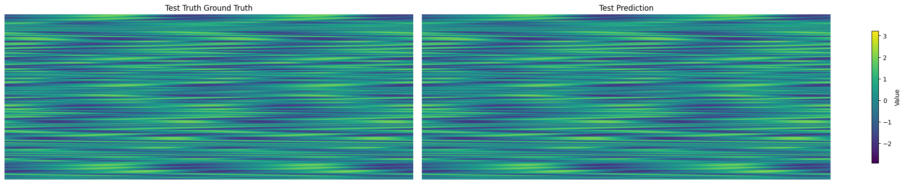

# SHRED-ROM Tutorial on Kuramoto Sivashinsky

[](https://colab.research.google.com/drive/1eFR-3l6qFgo3360V2LrJqBPSLheI4Mfd)

#### Import Libraries


```python
# PYSHRED
import pyshred
from pyshred import ParametricDataManager, SHRED, ParametricSHREDEngine

# Other helper libraries
import matplotlib.pyplot as plt
from scipy.io import loadmat
import torch
import numpy as np
```

#### Load Kuramoto Sivashinsky dataset


```python
import numpy as np
import urllib.request
# URL of the NPZ file
url = 'https://zenodo.org/records/14524524/files/KuramotoSivashinsky_data.npz?download=1'
# Local filename to save the downloaded file
filename = 'KuramotoSivashinsky_data.npz'
# Download the file from the URL
urllib.request.urlretrieve(url, filename)
# Load the data from the NPZ file
dataset = np.load(filename)
```

#### Device Info


```python
device = pyshred.set_device("auto")
# device = pyshred.set_device("cpu") # force CPU
# device = pyshred.set_device("cuda") # force CUDA
# device = pyshred.set_device("mps") # force MPS
# device = pyshred.set_device("cuda", device_id=0) # force specific GPU
pyshred.device_info()
```

    === PyShred Device Information ===
    Current device: cpu
    Device config: DeviceConfig(device_type=<DeviceType.AUTO: 'auto'>, device_id=None, force_cpu=False, warn_on_fallback=True)
    
    Device Availability:
      CUDA available: False
      MPS available: False
      CPU: Always available
    

#### Initialize Data Manager


```python
# Initialize ParametricSHREDDataManager
manager = ParametricDataManager(
    lags = 20,
    train_size = 0.8,
    val_size = 0.1,
    test_size = 0.1,
    )
```

#### Add datasets, sensors, and parameters

Each trajectory is generated with its own viscosity $\nu$ and initial-condition frequency $\omega$. These parameters are known, so they are passed with `params`: they are appended to the sensor measurements and fed to SHRED as additional inputs.


```python
data = dataset['u'] # shape (500, 201, 100)
params = dataset['mu'] # shape (500, 201, 2), viscosity and initial-condition frequency of each trajectory


manager.add_data(
    data=data,
    random=3,
    # stationary=[(15,),(30,),(45,)],
    id = 'KS',
    compress = False,
    params = params # known parameters, used as SHRED inputs
)

```

#### Analyze sensor summary


```python
manager.sensor_measurements_df
```


<div>
<style scoped>
    .dataframe tbody tr th:only-of-type {
        vertical-align: middle;
    }

    .dataframe tbody tr th {
        vertical-align: top;
    }

    .dataframe thead th {
        text-align: right;
    }
</style>
<table border="1" class="dataframe">
  <thead>
    <tr style="text-align: right;">
      <th></th>
      <th>KS-0</th>
      <th>KS-1</th>
      <th>KS-2</th>
    </tr>
  </thead>
  <tbody>
    <tr>
      <th>0</th>
      <td>-0.635770</td>
      <td>1.275942</td>
      <td>1.263547</td>
    </tr>
    <tr>
      <th>1</th>
      <td>-0.009224</td>
      <td>1.303912</td>
      <td>1.456658</td>
    </tr>
    <tr>
      <th>2</th>
      <td>0.065625</td>
      <td>1.347088</td>
      <td>1.508736</td>
    </tr>
    <tr>
      <th>3</th>
      <td>0.123444</td>
      <td>1.363364</td>
      <td>1.505672</td>
    </tr>
    <tr>
      <th>4</th>
      <td>0.169401</td>
      <td>1.368722</td>
      <td>1.466707</td>
    </tr>
    <tr>
      <th>...</th>
      <td>...</td>
      <td>...</td>
      <td>...</td>
    </tr>
    <tr>
      <th>100495</th>
      <td>-1.017887</td>
      <td>0.462683</td>
      <td>0.836941</td>
    </tr>
    <tr>
      <th>100496</th>
      <td>-0.898083</td>
      <td>0.149871</td>
      <td>0.450787</td>
    </tr>
    <tr>
      <th>100497</th>
      <td>-0.181915</td>
      <td>-0.086113</td>
      <td>0.161612</td>
    </tr>
    <tr>
      <th>100498</th>
      <td>1.055408</td>
      <td>-0.247151</td>
      <td>-0.032627</td>
    </tr>
    <tr>
      <th>100499</th>
      <td>1.991661</td>
      <td>-0.342044</td>
      <td>-0.152016</td>
    </tr>
  </tbody>
</table>
<p>100500 rows × 3 columns</p>
</div>


```python
manager.sensor_summary_df
```


<div>
<style scoped>
    .dataframe tbody tr th:only-of-type {
        vertical-align: middle;
    }

    .dataframe tbody tr th {
        vertical-align: top;
    }

    .dataframe thead th {
        text-align: right;
    }
</style>
<table border="1" class="dataframe">
  <thead>
    <tr style="text-align: right;">
      <th></th>
      <th>data id</th>
      <th>sensor_number</th>
      <th>type</th>
      <th>loc/traj</th>
    </tr>
  </thead>
  <tbody>
    <tr>
      <th>0</th>
      <td>KS</td>
      <td>0</td>
      <td>stationary (random)</td>
      <td>(98,)</td>
    </tr>
    <tr>
      <th>1</th>
      <td>KS</td>
      <td>1</td>
      <td>stationary (random)</td>
      <td>(67,)</td>
    </tr>
    <tr>
      <th>2</th>
      <td>KS</td>
      <td>2</td>
      <td>stationary (random)</td>
      <td>(70,)</td>
    </tr>
  </tbody>
</table>
</div>


#### Get train, validation, and test set


```python
train_dataset, val_dataset, test_dataset= manager.prepare()
```

#### Initialize SHRED

When using a `ParametricDataManager`, ensure `latent_forecaster` is set to None.


```python
shred = SHRED(sequence_model="LSTM", decoder_model="MLP", latent_forecaster=None)
```

#### Fit SHRED


```python
val_errors = shred.fit(train_dataset=train_dataset, val_dataset=val_dataset, num_epochs=20, sindy_regularization=0)
print('val_errors:', val_errors)
```

    Fitting SHRED...
    Epoch 1: Average training loss = 0.028137
    Validation MSE (epoch 1): 0.018579
    Epoch 2: Average training loss = 0.014994
    Validation MSE (epoch 2): 0.015761
    Epoch 3: Average training loss = 0.010345
    Validation MSE (epoch 3): 0.010857
    Epoch 4: Average training loss = 0.008295
    Validation MSE (epoch 4): 0.008991
    Epoch 5: Average training loss = 0.007120
    Validation MSE (epoch 5): 0.007761
    Epoch 6: Average training loss = 0.006270
    Validation MSE (epoch 6): 0.006944
    Epoch 7: Average training loss = 0.005664
    Validation MSE (epoch 7): 0.005938
    Epoch 8: Average training loss = 0.004873
    Validation MSE (epoch 8): 0.005198
    Epoch 9: Average training loss = 0.004528
    Validation MSE (epoch 9): 0.004805
    Epoch 10: Average training loss = 0.004071
    Validation MSE (epoch 10): 0.004450
    Epoch 11: Average training loss = 0.003998
    Validation MSE (epoch 11): 0.003996
    Epoch 12: Average training loss = 0.003527
    Validation MSE (epoch 12): 0.003770
    Epoch 13: Average training loss = 0.003192
    Validation MSE (epoch 13): 0.003518
    Epoch 14: Average training loss = 0.003120
    Validation MSE (epoch 14): 0.003331
    Epoch 15: Average training loss = 0.002862
    Validation MSE (epoch 15): 0.003318
    Epoch 16: Average training loss = 0.002878
    Validation MSE (epoch 16): 0.003221
    Epoch 17: Average training loss = 0.002497
    Validation MSE (epoch 17): 0.002894
    Epoch 18: Average training loss = 0.002609
    Validation MSE (epoch 18): 0.002869
    Epoch 19: Average training loss = 0.002328
    Validation MSE (epoch 19): 0.002836
    Epoch 20: Average training loss = 0.002440
    Validation MSE (epoch 20): 0.002678
    val_errors: [0.01857916 0.01576086 0.01085739 0.00899064 0.00776056 0.00694414
     0.00593846 0.00519833 0.00480512 0.00445011 0.00399566 0.00376983
     0.00351774 0.00333149 0.00331767 0.00322056 0.00289442 0.00286948
     0.00283613 0.00267774]
    

#### Evaluate SHRED


```python
train_mse = shred.evaluate(dataset=train_dataset)
val_mse = shred.evaluate(dataset=val_dataset)
test_mse = shred.evaluate(dataset=test_dataset)
print(f"Train MSE: {train_mse:.3f}")
print(f"Val   MSE: {val_mse:.3f}")
print(f"Test  MSE: {test_mse:.3f}")
```

    Train MSE: 0.001
    Val   MSE: 0.003
    Test  MSE: 0.001
    

#### Initialize Parametric SHRED Engine for Downstream Tasks


```python
engine = ParametricSHREDEngine(manager, shred)
```

#### Sensor Measurements to Latent Space


```python
test_latent_from_sensors = engine.sensor_to_latent(manager.test_sensor_measurements, params=manager.test_params)
```

#### Decode Latent Space to Full-State Space


```python
test_prediction = engine.decode(test_latent_from_sensors) # latent space generated from sensor data
```

#### Compare prediction against the truth

Since both number of trajectories (`data.shape[0]`) and number of timesteps (`data.shape[1]`) are both variable, we will leave them combined on the first axis. The remaining axes are all spatial dimensions.


```python
spatial_shape = data.shape[2:]
test_data = data[manager.test_indices]
truth      = test_data.reshape(-1, *spatial_shape)
prediction = test_prediction['KS']

compare_data = [truth, prediction]
titles = ["Test Truth Ground Truth", "Test Prediction"]

vmin, vmax = np.min([d.min() for d in compare_data]), np.max([d.max() for d in compare_data])

fig, axes = plt.subplots(1, 2, figsize=(20, 4), constrained_layout=True)

for ax, d, title in zip(axes, compare_data, titles):
    im = ax.imshow(d, vmin=vmin, vmax=vmax, aspect='auto')
    ax.set(title=title)
    ax.axis("off")

fig.colorbar(im, ax=axes, label="Value", shrink=0.8)
```


    <matplotlib.colorbar.Colorbar at 0x21d440f5a90>


    

    


#### Estimating unknown parameters

If the parameters are not known, SHRED can estimate them from the sensor measurements instead. Rather than passing them with `params`, add them as a dataset, and SHRED reconstructs them like any other field:

```python
manager.add_data(
    data=params,
    id = 'MU',
    compress = False
)
```

The estimates are then available as `engine.decode(latents)['MU']`.

#### Evaluate MSE on Ground Truth Data

Since both number of trajectories (`data.shape[0]`) and number of timesteps (`data.shape[1]`) are both variable, we will leave them combined on the first axis. The remaining axes are all spatial dimensions.


```python
# Train
t_train = len(manager.train_sensor_measurements)
train_Y = {'KS': data[0:t_train].reshape(-1, *spatial_shape)} # unpack the spatial dimensions
train_error = engine.evaluate(manager.train_sensor_measurements, train_Y, params=manager.train_params)

# Val
t_val = len(manager.val_sensor_measurements)
val_Y = {'KS': data[t_train:t_train+t_val].reshape(-1, *spatial_shape)}
val_error = engine.evaluate(manager.val_sensor_measurements, val_Y, params=manager.val_params)

# Test
t_test = len(manager.test_sensor_measurements)
test_Y = {'KS': data[-t_test:].reshape(-1, *spatial_shape)}
test_error = engine.evaluate(manager.test_sensor_measurements, test_Y, params=manager.test_params)

print('---------- TRAIN ----------')
print(train_error)
print('\n---------- VAL   ----------')
print(val_error)
print('\n---------- TEST  ----------')
print(test_error)
```

    ---------- TRAIN ----------
                  MSE      RMSE      MAE        R2
    dataset                                       
    KS       0.048213  0.219573  0.13134  0.963312
    
    ---------- VAL   ----------
                  MSE      RMSE       MAE        R2
    dataset                                        
    KS       0.091595  0.302647  0.175856  0.929226
    
    ---------- TEST  ----------
                  MSE     RMSE       MAE        R2
    dataset                                       
    KS       0.050122  0.22388  0.125677  0.961874
    
