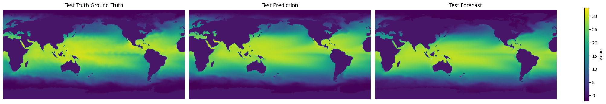

# SINDy-SHRED Tutorial on Sea Surface Temperature


```python
%load_ext autoreload
%autoreload 2
```

#### Import Libraries


```python
# PYSHRED
from pyshred import DataManager, SHRED, SHREDEngine, SINDy_Forecaster

# Other helper libraries
import matplotlib.pyplot as plt
from scipy.io import loadmat
import torch
import numpy as np
```

#### Load in SST Data


```python
mat = loadmat("SST_data.mat")
sst_data = mat['Z'].T
sst_data = sst_data.reshape(1400, 180, 360)
sst_data.shape
```


    (1400, 180, 360)


```python
# Plotting a single frame
plt.figure()
plt.imshow(sst_data[0]) 
plt.colorbar()
plt.show()
```


    

    


#### Initialize Data Manager


```python
manager = DataManager(
    lags = 52,
    train_size = 0.8,
    val_size = 0.1,
    test_size = 0.1,
)
```

#### Add datasets and sensors


```python
manager.add_data(
    data = sst_data,
    id = "SST",
    random = 50,
    # mobile=,
    # stationary=,
    # measurements=,
    compress=False,
)
```

#### Analyze sensor summary


```python
manager.sensor_summary_df
```


<div>
<style scoped>
    .dataframe tbody tr th:only-of-type {
        vertical-align: middle;
    }

    .dataframe tbody tr th {
        vertical-align: top;
    }

    .dataframe thead th {
        text-align: right;
    }
</style>
<table border="1" class="dataframe">
  <thead>
    <tr style="text-align: right;">
      <th></th>
      <th>data id</th>
      <th>number</th>
      <th>type</th>
      <th>loc/traj</th>
    </tr>
  </thead>
  <tbody>
    <tr>
      <th>0</th>
      <td>SST</td>
      <td>0</td>
      <td>stationary (random)</td>
      <td>(75, 91)</td>
    </tr>
    <tr>
      <th>1</th>
      <td>SST</td>
      <td>1</td>
      <td>stationary (random)</td>
      <td>(90, 153)</td>
    </tr>
    <tr>
      <th>2</th>
      <td>SST</td>
      <td>2</td>
      <td>stationary (random)</td>
      <td>(65, 138)</td>
    </tr>
    <tr>
      <th>3</th>
      <td>SST</td>
      <td>3</td>
      <td>stationary (random)</td>
      <td>(154, 67)</td>
    </tr>
    <tr>
      <th>4</th>
      <td>SST</td>
      <td>4</td>
      <td>stationary (random)</td>
      <td>(172, 204)</td>
    </tr>
    <tr>
      <th>5</th>
      <td>SST</td>
      <td>5</td>
      <td>stationary (random)</td>
      <td>(49, 124)</td>
    </tr>
    <tr>
      <th>6</th>
      <td>SST</td>
      <td>6</td>
      <td>stationary (random)</td>
      <td>(110, 164)</td>
    </tr>
    <tr>
      <th>7</th>
      <td>SST</td>
      <td>7</td>
      <td>stationary (random)</td>
      <td>(164, 88)</td>
    </tr>
    <tr>
      <th>8</th>
      <td>SST</td>
      <td>8</td>
      <td>stationary (random)</td>
      <td>(96, 178)</td>
    </tr>
    <tr>
      <th>9</th>
      <td>SST</td>
      <td>9</td>
      <td>stationary (random)</td>
      <td>(128, 183)</td>
    </tr>
    <tr>
      <th>10</th>
      <td>SST</td>
      <td>10</td>
      <td>stationary (random)</td>
      <td>(34, 325)</td>
    </tr>
    <tr>
      <th>11</th>
      <td>SST</td>
      <td>11</td>
      <td>stationary (random)</td>
      <td>(175, 141)</td>
    </tr>
    <tr>
      <th>12</th>
      <td>SST</td>
      <td>12</td>
      <td>stationary (random)</td>
      <td>(11, 226)</td>
    </tr>
    <tr>
      <th>13</th>
      <td>SST</td>
      <td>13</td>
      <td>stationary (random)</td>
      <td>(39, 211)</td>
    </tr>
    <tr>
      <th>14</th>
      <td>SST</td>
      <td>14</td>
      <td>stationary (random)</td>
      <td>(151, 153)</td>
    </tr>
    <tr>
      <th>15</th>
      <td>SST</td>
      <td>15</td>
      <td>stationary (random)</td>
      <td>(144, 151)</td>
    </tr>
    <tr>
      <th>16</th>
      <td>SST</td>
      <td>16</td>
      <td>stationary (random)</td>
      <td>(48, 187)</td>
    </tr>
    <tr>
      <th>17</th>
      <td>SST</td>
      <td>17</td>
      <td>stationary (random)</td>
      <td>(52, 359)</td>
    </tr>
    <tr>
      <th>18</th>
      <td>SST</td>
      <td>18</td>
      <td>stationary (random)</td>
      <td>(138, 85)</td>
    </tr>
    <tr>
      <th>19</th>
      <td>SST</td>
      <td>19</td>
      <td>stationary (random)</td>
      <td>(9, 157)</td>
    </tr>
    <tr>
      <th>20</th>
      <td>SST</td>
      <td>20</td>
      <td>stationary (random)</td>
      <td>(13, 171)</td>
    </tr>
    <tr>
      <th>21</th>
      <td>SST</td>
      <td>21</td>
      <td>stationary (random)</td>
      <td>(54, 273)</td>
    </tr>
    <tr>
      <th>22</th>
      <td>SST</td>
      <td>22</td>
      <td>stationary (random)</td>
      <td>(159, 220)</td>
    </tr>
    <tr>
      <th>23</th>
      <td>SST</td>
      <td>23</td>
      <td>stationary (random)</td>
      <td>(105, 87)</td>
    </tr>
    <tr>
      <th>24</th>
      <td>SST</td>
      <td>24</td>
      <td>stationary (random)</td>
      <td>(74, 107)</td>
    </tr>
    <tr>
      <th>25</th>
      <td>SST</td>
      <td>25</td>
      <td>stationary (random)</td>
      <td>(124, 284)</td>
    </tr>
    <tr>
      <th>26</th>
      <td>SST</td>
      <td>26</td>
      <td>stationary (random)</td>
      <td>(129, 344)</td>
    </tr>
    <tr>
      <th>27</th>
      <td>SST</td>
      <td>27</td>
      <td>stationary (random)</td>
      <td>(11, 334)</td>
    </tr>
    <tr>
      <th>28</th>
      <td>SST</td>
      <td>28</td>
      <td>stationary (random)</td>
      <td>(130, 140)</td>
    </tr>
    <tr>
      <th>29</th>
      <td>SST</td>
      <td>29</td>
      <td>stationary (random)</td>
      <td>(119, 144)</td>
    </tr>
    <tr>
      <th>30</th>
      <td>SST</td>
      <td>30</td>
      <td>stationary (random)</td>
      <td>(145, 285)</td>
    </tr>
    <tr>
      <th>31</th>
      <td>SST</td>
      <td>31</td>
      <td>stationary (random)</td>
      <td>(115, 280)</td>
    </tr>
    <tr>
      <th>32</th>
      <td>SST</td>
      <td>32</td>
      <td>stationary (random)</td>
      <td>(31, 231)</td>
    </tr>
    <tr>
      <th>33</th>
      <td>SST</td>
      <td>33</td>
      <td>stationary (random)</td>
      <td>(88, 58)</td>
    </tr>
    <tr>
      <th>34</th>
      <td>SST</td>
      <td>34</td>
      <td>stationary (random)</td>
      <td>(83, 249)</td>
    </tr>
    <tr>
      <th>35</th>
      <td>SST</td>
      <td>35</td>
      <td>stationary (random)</td>
      <td>(178, 244)</td>
    </tr>
    <tr>
      <th>36</th>
      <td>SST</td>
      <td>36</td>
      <td>stationary (random)</td>
      <td>(47, 199)</td>
    </tr>
    <tr>
      <th>37</th>
      <td>SST</td>
      <td>37</td>
      <td>stationary (random)</td>
      <td>(174, 77)</td>
    </tr>
    <tr>
      <th>38</th>
      <td>SST</td>
      <td>38</td>
      <td>stationary (random)</td>
      <td>(74, 143)</td>
    </tr>
    <tr>
      <th>39</th>
      <td>SST</td>
      <td>39</td>
      <td>stationary (random)</td>
      <td>(63, 178)</td>
    </tr>
    <tr>
      <th>40</th>
      <td>SST</td>
      <td>40</td>
      <td>stationary (random)</td>
      <td>(23, 124)</td>
    </tr>
    <tr>
      <th>41</th>
      <td>SST</td>
      <td>41</td>
      <td>stationary (random)</td>
      <td>(71, 221)</td>
    </tr>
    <tr>
      <th>42</th>
      <td>SST</td>
      <td>42</td>
      <td>stationary (random)</td>
      <td>(51, 196)</td>
    </tr>
    <tr>
      <th>43</th>
      <td>SST</td>
      <td>43</td>
      <td>stationary (random)</td>
      <td>(153, 307)</td>
    </tr>
    <tr>
      <th>44</th>
      <td>SST</td>
      <td>44</td>
      <td>stationary (random)</td>
      <td>(41, 133)</td>
    </tr>
    <tr>
      <th>45</th>
      <td>SST</td>
      <td>45</td>
      <td>stationary (random)</td>
      <td>(28, 336)</td>
    </tr>
    <tr>
      <th>46</th>
      <td>SST</td>
      <td>46</td>
      <td>stationary (random)</td>
      <td>(6, 25)</td>
    </tr>
    <tr>
      <th>47</th>
      <td>SST</td>
      <td>47</td>
      <td>stationary (random)</td>
      <td>(160, 86)</td>
    </tr>
    <tr>
      <th>48</th>
      <td>SST</td>
      <td>48</td>
      <td>stationary (random)</td>
      <td>(69, 103)</td>
    </tr>
    <tr>
      <th>49</th>
      <td>SST</td>
      <td>49</td>
      <td>stationary (random)</td>
      <td>(149, 298)</td>
    </tr>
  </tbody>
</table>
</div>


```python
manager.sensor_measurements_df
```


<div>
<style scoped>
    .dataframe tbody tr th:only-of-type {
        vertical-align: middle;
    }

    .dataframe tbody tr th {
        vertical-align: top;
    }

    .dataframe thead th {
        text-align: right;
    }
</style>
<table border="1" class="dataframe">
  <thead>
    <tr style="text-align: right;">
      <th>data id</th>
      <th>SST-0</th>
      <th>SST-1</th>
      <th>SST-2</th>
      <th>SST-3</th>
      <th>SST-4</th>
      <th>SST-5</th>
      <th>SST-6</th>
      <th>SST-7</th>
      <th>SST-8</th>
      <th>SST-9</th>
      <th>...</th>
      <th>SST-40</th>
      <th>SST-41</th>
      <th>SST-42</th>
      <th>SST-43</th>
      <th>SST-44</th>
      <th>SST-45</th>
      <th>SST-46</th>
      <th>SST-47</th>
      <th>SST-48</th>
      <th>SST-49</th>
    </tr>
  </thead>
  <tbody>
    <tr>
      <th>0</th>
      <td>27.469999</td>
      <td>29.429999</td>
      <td>23.279999</td>
      <td>0.00</td>
      <td>-0.0</td>
      <td>0.0</td>
      <td>26.519999</td>
      <td>-0.0</td>
      <td>29.949999</td>
      <td>18.47</td>
      <td>...</td>
      <td>-0.0</td>
      <td>23.669999</td>
      <td>13.52</td>
      <td>-0.07</td>
      <td>0.0</td>
      <td>7.71</td>
      <td>-1.42</td>
      <td>-0.0</td>
      <td>0.0</td>
      <td>5.09</td>
    </tr>
    <tr>
      <th>1</th>
      <td>26.969999</td>
      <td>29.659999</td>
      <td>22.979999</td>
      <td>0.05</td>
      <td>-0.0</td>
      <td>0.0</td>
      <td>27.229999</td>
      <td>-0.0</td>
      <td>29.889999</td>
      <td>18.51</td>
      <td>...</td>
      <td>-0.0</td>
      <td>23.459999</td>
      <td>13.38</td>
      <td>-0.04</td>
      <td>0.0</td>
      <td>7.58</td>
      <td>-1.20</td>
      <td>-0.0</td>
      <td>0.0</td>
      <td>4.97</td>
    </tr>
    <tr>
      <th>2</th>
      <td>26.179999</td>
      <td>29.749999</td>
      <td>22.629999</td>
      <td>0.01</td>
      <td>-0.0</td>
      <td>0.0</td>
      <td>27.949999</td>
      <td>-0.0</td>
      <td>29.839999</td>
      <td>19.14</td>
      <td>...</td>
      <td>-0.0</td>
      <td>23.419999</td>
      <td>12.65</td>
      <td>-0.07</td>
      <td>0.0</td>
      <td>7.13</td>
      <td>-1.05</td>
      <td>-0.0</td>
      <td>0.0</td>
      <td>5.57</td>
    </tr>
    <tr>
      <th>3</th>
      <td>26.309999</td>
      <td>29.199999</td>
      <td>21.990000</td>
      <td>-0.01</td>
      <td>-0.0</td>
      <td>0.0</td>
      <td>27.829999</td>
      <td>-0.0</td>
      <td>29.649999</td>
      <td>19.19</td>
      <td>...</td>
      <td>-0.0</td>
      <td>23.029999</td>
      <td>12.90</td>
      <td>0.05</td>
      <td>0.0</td>
      <td>7.21</td>
      <td>-0.75</td>
      <td>-0.0</td>
      <td>0.0</td>
      <td>6.00</td>
    </tr>
    <tr>
      <th>4</th>
      <td>26.719999</td>
      <td>29.119999</td>
      <td>22.429999</td>
      <td>-0.02</td>
      <td>-0.0</td>
      <td>0.0</td>
      <td>27.679999</td>
      <td>-0.0</td>
      <td>29.169999</td>
      <td>19.59</td>
      <td>...</td>
      <td>-0.0</td>
      <td>23.219999</td>
      <td>12.70</td>
      <td>0.17</td>
      <td>0.0</td>
      <td>7.30</td>
      <td>-0.77</td>
      <td>-0.0</td>
      <td>0.0</td>
      <td>5.62</td>
    </tr>
    <tr>
      <th>...</th>
      <td>...</td>
      <td>...</td>
      <td>...</td>
      <td>...</td>
      <td>...</td>
      <td>...</td>
      <td>...</td>
      <td>...</td>
      <td>...</td>
      <td>...</td>
      <td>...</td>
      <td>...</td>
      <td>...</td>
      <td>...</td>
      <td>...</td>
      <td>...</td>
      <td>...</td>
      <td>...</td>
      <td>...</td>
      <td>...</td>
      <td>...</td>
    </tr>
    <tr>
      <th>1395</th>
      <td>29.109999</td>
      <td>29.909999</td>
      <td>28.679999</td>
      <td>-1.74</td>
      <td>-0.0</td>
      <td>0.0</td>
      <td>24.329999</td>
      <td>-0.0</td>
      <td>29.749999</td>
      <td>14.17</td>
      <td>...</td>
      <td>0.0</td>
      <td>26.669999</td>
      <td>21.35</td>
      <td>-0.98</td>
      <td>0.0</td>
      <td>11.19</td>
      <td>-1.47</td>
      <td>-0.0</td>
      <td>0.0</td>
      <td>-0.54</td>
    </tr>
    <tr>
      <th>1396</th>
      <td>29.049999</td>
      <td>30.049999</td>
      <td>28.689999</td>
      <td>-1.65</td>
      <td>-0.0</td>
      <td>0.0</td>
      <td>25.209999</td>
      <td>-0.0</td>
      <td>29.739999</td>
      <td>14.45</td>
      <td>...</td>
      <td>0.0</td>
      <td>26.409999</td>
      <td>21.20</td>
      <td>-0.99</td>
      <td>0.0</td>
      <td>10.40</td>
      <td>-1.30</td>
      <td>-0.0</td>
      <td>0.0</td>
      <td>-0.34</td>
    </tr>
    <tr>
      <th>1397</th>
      <td>29.239999</td>
      <td>30.269999</td>
      <td>28.869999</td>
      <td>-1.45</td>
      <td>-0.0</td>
      <td>0.0</td>
      <td>24.659999</td>
      <td>-0.0</td>
      <td>29.929999</td>
      <td>14.91</td>
      <td>...</td>
      <td>0.0</td>
      <td>26.599999</td>
      <td>19.85</td>
      <td>-0.80</td>
      <td>0.0</td>
      <td>9.84</td>
      <td>-1.28</td>
      <td>-0.0</td>
      <td>0.0</td>
      <td>-0.49</td>
    </tr>
    <tr>
      <th>1398</th>
      <td>29.589999</td>
      <td>30.329999</td>
      <td>28.999999</td>
      <td>-1.50</td>
      <td>-0.0</td>
      <td>0.0</td>
      <td>24.879999</td>
      <td>-0.0</td>
      <td>29.839999</td>
      <td>15.03</td>
      <td>...</td>
      <td>0.0</td>
      <td>26.599999</td>
      <td>18.45</td>
      <td>-0.99</td>
      <td>0.0</td>
      <td>9.53</td>
      <td>-1.30</td>
      <td>-0.0</td>
      <td>0.0</td>
      <td>-0.84</td>
    </tr>
    <tr>
      <th>1399</th>
      <td>29.199999</td>
      <td>30.429999</td>
      <td>28.679999</td>
      <td>-1.57</td>
      <td>-0.0</td>
      <td>0.0</td>
      <td>24.799999</td>
      <td>-0.0</td>
      <td>30.029999</td>
      <td>15.54</td>
      <td>...</td>
      <td>0.0</td>
      <td>26.489999</td>
      <td>18.15</td>
      <td>-1.20</td>
      <td>0.0</td>
      <td>9.34</td>
      <td>-1.34</td>
      <td>-0.0</td>
      <td>0.0</td>
      <td>-0.75</td>
    </tr>
  </tbody>
</table>
<p>1400 rows × 50 columns</p>
</div>


#### Get train, validation, and test set


```python
train_dataset, val_dataset, test_dataset= manager.prepare()
```

#### Initialize a latent forecaster


```python
latent_forecaster = SINDy_Forecaster(poly_order=1, include_sine=True, dt=1/5)
```

#### Initialize SHRED


```python
shred = SHRED(sequence_model="GRU", decoder_model="MLP", latent_forecaster=latent_forecaster)
```

#### Fit SHRED


```python
val_errors = shred.fit(train_dataset=train_dataset, val_dataset=val_dataset, num_epochs=10, thres_epoch=20, sindy_regularization=1)
print('val_errors:', val_errors)
```

    Fitting SindySHRED...
    Epoch 1: Average training loss = 0.113462
    Validation MSE (epoch 1): 0.035907
    Epoch 2: Average training loss = 0.050084
    Validation MSE (epoch 2): 0.017119
    Epoch 3: Average training loss = 0.025530
    Validation MSE (epoch 3): 0.017065
    Epoch 4: Average training loss = 0.022404
    Validation MSE (epoch 4): 0.015441
    Epoch 5: Average training loss = 0.022002
    Validation MSE (epoch 5): 0.014016
    Epoch 6: Average training loss = 0.021343
    Validation MSE (epoch 6): 0.013516
    Epoch 7: Average training loss = 0.020509
    Validation MSE (epoch 7): 0.013060
    Epoch 8: Average training loss = 0.019463
    Validation MSE (epoch 8): 0.012592
    Epoch 9: Average training loss = 0.018733
    Validation MSE (epoch 9): 0.012087
    Epoch 10: Average training loss = 0.017903
    Validation MSE (epoch 10): 0.011690
    val_errors: [0.03590691 0.01711907 0.01706486 0.01544069 0.01401623 0.01351578
     0.01306047 0.01259177 0.01208725 0.01168976]
    

#### Evaluate SHRED


```python
train_mse = shred.evaluate(dataset=train_dataset)
val_mse = shred.evaluate(dataset=val_dataset)
test_mse = shred.evaluate(dataset=test_dataset)
print(f"Train MSE: {train_mse:.3f}")
print(f"Val   MSE: {val_mse:.3f}")
print(f"Test  MSE: {test_mse:.3f}")
```

    Train MSE: 0.010
    Val   MSE: 0.012
    Test  MSE: 0.017
    

#### SINDy Discovered Latent Dynamics


```python
print(shred.latent_forecaster)
```

    (x0)' = 0.008 1 + -0.047 x0 + -0.026 x1 + 0.006 x2
    (x1)' = -0.041 1 + -0.174 x0 + 0.578 x1 + 0.588 x2
    (x2)' = 0.144 1 + 0.080 x0 + -0.939 x1 + -0.593 x2
    

#### Initialize SHRED Engine for Downstream Tasks


```python
engine = SHREDEngine(manager, shred)
```

#### Sensor Measurements to Latent Space


```python
test_latent_from_sensors = engine.sensor_to_latent(manager.test_sensor_measurements)
```

#### Forecast Latent Space (No Sensor Measurements)


```python
engine.model.latent_forecaster
```


    SINDy_Forecaster()


```python
val_latents = engine.sensor_to_latent(manager.val_sensor_measurements)
init_latents = val_latents[-1] # seed forecaster with final latent space from val
t = len(manager.test_sensor_measurements)
test_latent_from_forecaster = engine.forecast_latent(t=t, init_latents=init_latents)
```

#### Decode Latent Space to Full-State Space


```python
test_prediction = engine.decode(test_latent_from_sensors) # latent space generated from sensor data
test_forecast = engine.decode(test_latent_from_forecaster) # latent space generated from latent forecasted (no sensor data)
```

Compare final frame in prediction and forecast to ground truth:


```python
truth      = sst_data[-1]
prediction = test_prediction['SST'][t-1]
forecast   = test_forecast['SST'][t-1]

data   = [truth, prediction, forecast]
titles = ["Test Truth Ground Truth", "Test Prediction", "Test Forecast"]

vmin, vmax = np.min([d.min() for d in data]), np.max([d.max() for d in data])

fig, axes = plt.subplots(1, 3, figsize=(20, 4), constrained_layout=True)

for ax, d, title in zip(axes, data, titles):
    im = ax.imshow(d, vmin=vmin, vmax=vmax)
    ax.set(title=title)
    ax.axis("off")

fig.colorbar(im, ax=axes, label="Value", shrink=0.8)
```


    <matplotlib.colorbar.Colorbar at 0x2ae5e385990>


    

    


#### Evaluate MSE on Ground Truth Data


```python
# Train
t_train = len(manager.train_sensor_measurements)
train_Y = {'SST': sst_data[0:t_train]}
train_error = engine.evaluate(manager.train_sensor_measurements, train_Y)

# Val
t_val = len(manager.test_sensor_measurements)
val_Y = {'SST': sst_data[t_train:t_train+t_val]}
val_error = engine.evaluate(manager.val_sensor_measurements, val_Y)

# Test
t_test = len(manager.test_sensor_measurements)
test_Y = {'SST': sst_data[-t_test:]}
test_error = engine.evaluate(manager.test_sensor_measurements, test_Y)

print('---------- TRAIN ----------')
print(train_error)
print('\n---------- VAL   ----------')
print(val_error)
print('\n---------- TEST  ----------')
print(test_error)
```

    ---------- TRAIN ----------
                  MSE      RMSE       MAE       R2
    dataset                                       
    SST      0.617007  0.785498  0.426965  0.41722
    
    ---------- VAL   ----------
                  MSE      RMSE       MAE        R2
    dataset                                        
    SST      0.744356  0.862761  0.459704 -0.394776
    
    ---------- TEST  ----------
                  MSE      RMSE       MAE        R2
    dataset                                        
    SST      1.229534  1.108844  0.622832 -0.556659
    
