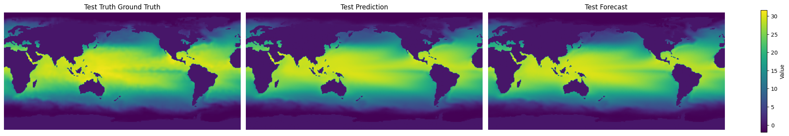

# SINDy-SHRED Tutorial on Sea Surface Temperature

#### Import Libraries


```python
# PYSHRED
from pyshred import DataManager, SHRED, SHREDEngine, SINDy_Forecaster

# Other helper libraries
import matplotlib.pyplot as plt
from scipy.io import loadmat
import torch
import numpy as np
```

#### Load in SST Data


```python
sst_data = np.load("sst_data.npy")
```


```python
# Plotting a single frame
plt.figure()
plt.imshow(sst_data[0]) 
plt.colorbar()
plt.show()
```


    

    


#### Initialize Data Manager


```python
manager = DataManager(
    lags = 52,
    train_size = 0.8,
    val_size = 0.1,
    test_size = 0.1,
)
```

#### Add datasets and sensors


```python
manager.add_data(
    data = sst_data,
    id = "SST",
    random = 50,
    # mobile=,
    # stationary=,
    # measurements=,
    compress=False,
)
```

#### Analyze sensor summary


```python
manager.sensor_summary_df
```


<div>
<style scoped>
    .dataframe tbody tr th:only-of-type {
        vertical-align: middle;
    }

    .dataframe tbody tr th {
        vertical-align: top;
    }

    .dataframe thead th {
        text-align: right;
    }
</style>
<table border="1" class="dataframe">
  <thead>
    <tr style="text-align: right;">
      <th></th>
      <th>data id</th>
      <th>sensor_number</th>
      <th>type</th>
      <th>loc/traj</th>
    </tr>
  </thead>
  <tbody>
    <tr>
      <th>0</th>
      <td>SST</td>
      <td>0</td>
      <td>stationary (random)</td>
      <td>(151, 324)</td>
    </tr>
    <tr>
      <th>1</th>
      <td>SST</td>
      <td>1</td>
      <td>stationary (random)</td>
      <td>(12, 332)</td>
    </tr>
    <tr>
      <th>2</th>
      <td>SST</td>
      <td>2</td>
      <td>stationary (random)</td>
      <td>(158, 117)</td>
    </tr>
    <tr>
      <th>3</th>
      <td>SST</td>
      <td>3</td>
      <td>stationary (random)</td>
      <td>(105, 38)</td>
    </tr>
    <tr>
      <th>4</th>
      <td>SST</td>
      <td>4</td>
      <td>stationary (random)</td>
      <td>(131, 134)</td>
    </tr>
    <tr>
      <th>5</th>
      <td>SST</td>
      <td>5</td>
      <td>stationary (random)</td>
      <td>(147, 44)</td>
    </tr>
    <tr>
      <th>6</th>
      <td>SST</td>
      <td>6</td>
      <td>stationary (random)</td>
      <td>(155, 176)</td>
    </tr>
    <tr>
      <th>7</th>
      <td>SST</td>
      <td>7</td>
      <td>stationary (random)</td>
      <td>(88, 208)</td>
    </tr>
    <tr>
      <th>8</th>
      <td>SST</td>
      <td>8</td>
      <td>stationary (random)</td>
      <td>(142, 176)</td>
    </tr>
    <tr>
      <th>9</th>
      <td>SST</td>
      <td>9</td>
      <td>stationary (random)</td>
      <td>(134, 105)</td>
    </tr>
    <tr>
      <th>10</th>
      <td>SST</td>
      <td>10</td>
      <td>stationary (random)</td>
      <td>(154, 19)</td>
    </tr>
    <tr>
      <th>11</th>
      <td>SST</td>
      <td>11</td>
      <td>stationary (random)</td>
      <td>(174, 107)</td>
    </tr>
    <tr>
      <th>12</th>
      <td>SST</td>
      <td>12</td>
      <td>stationary (random)</td>
      <td>(47, 194)</td>
    </tr>
    <tr>
      <th>13</th>
      <td>SST</td>
      <td>13</td>
      <td>stationary (random)</td>
      <td>(46, 96)</td>
    </tr>
    <tr>
      <th>14</th>
      <td>SST</td>
      <td>14</td>
      <td>stationary (random)</td>
      <td>(128, 247)</td>
    </tr>
    <tr>
      <th>15</th>
      <td>SST</td>
      <td>15</td>
      <td>stationary (random)</td>
      <td>(142, 219)</td>
    </tr>
    <tr>
      <th>16</th>
      <td>SST</td>
      <td>16</td>
      <td>stationary (random)</td>
      <td>(152, 158)</td>
    </tr>
    <tr>
      <th>17</th>
      <td>SST</td>
      <td>17</td>
      <td>stationary (random)</td>
      <td>(132, 104)</td>
    </tr>
    <tr>
      <th>18</th>
      <td>SST</td>
      <td>18</td>
      <td>stationary (random)</td>
      <td>(154, 233)</td>
    </tr>
    <tr>
      <th>19</th>
      <td>SST</td>
      <td>19</td>
      <td>stationary (random)</td>
      <td>(129, 221)</td>
    </tr>
    <tr>
      <th>20</th>
      <td>SST</td>
      <td>20</td>
      <td>stationary (random)</td>
      <td>(36, 43)</td>
    </tr>
    <tr>
      <th>21</th>
      <td>SST</td>
      <td>21</td>
      <td>stationary (random)</td>
      <td>(74, 141)</td>
    </tr>
    <tr>
      <th>22</th>
      <td>SST</td>
      <td>22</td>
      <td>stationary (random)</td>
      <td>(106, 201)</td>
    </tr>
    <tr>
      <th>23</th>
      <td>SST</td>
      <td>23</td>
      <td>stationary (random)</td>
      <td>(27, 94)</td>
    </tr>
    <tr>
      <th>24</th>
      <td>SST</td>
      <td>24</td>
      <td>stationary (random)</td>
      <td>(63, 174)</td>
    </tr>
    <tr>
      <th>25</th>
      <td>SST</td>
      <td>25</td>
      <td>stationary (random)</td>
      <td>(49, 148)</td>
    </tr>
    <tr>
      <th>26</th>
      <td>SST</td>
      <td>26</td>
      <td>stationary (random)</td>
      <td>(27, 290)</td>
    </tr>
    <tr>
      <th>27</th>
      <td>SST</td>
      <td>27</td>
      <td>stationary (random)</td>
      <td>(147, 348)</td>
    </tr>
    <tr>
      <th>28</th>
      <td>SST</td>
      <td>28</td>
      <td>stationary (random)</td>
      <td>(122, 310)</td>
    </tr>
    <tr>
      <th>29</th>
      <td>SST</td>
      <td>29</td>
      <td>stationary (random)</td>
      <td>(85, 298)</td>
    </tr>
    <tr>
      <th>30</th>
      <td>SST</td>
      <td>30</td>
      <td>stationary (random)</td>
      <td>(170, 358)</td>
    </tr>
    <tr>
      <th>31</th>
      <td>SST</td>
      <td>31</td>
      <td>stationary (random)</td>
      <td>(151, 183)</td>
    </tr>
    <tr>
      <th>32</th>
      <td>SST</td>
      <td>32</td>
      <td>stationary (random)</td>
      <td>(177, 220)</td>
    </tr>
    <tr>
      <th>33</th>
      <td>SST</td>
      <td>33</td>
      <td>stationary (random)</td>
      <td>(42, 305)</td>
    </tr>
    <tr>
      <th>34</th>
      <td>SST</td>
      <td>34</td>
      <td>stationary (random)</td>
      <td>(45, 17)</td>
    </tr>
    <tr>
      <th>35</th>
      <td>SST</td>
      <td>35</td>
      <td>stationary (random)</td>
      <td>(31, 125)</td>
    </tr>
    <tr>
      <th>36</th>
      <td>SST</td>
      <td>36</td>
      <td>stationary (random)</td>
      <td>(153, 333)</td>
    </tr>
    <tr>
      <th>37</th>
      <td>SST</td>
      <td>37</td>
      <td>stationary (random)</td>
      <td>(29, 343)</td>
    </tr>
    <tr>
      <th>38</th>
      <td>SST</td>
      <td>38</td>
      <td>stationary (random)</td>
      <td>(38, 190)</td>
    </tr>
    <tr>
      <th>39</th>
      <td>SST</td>
      <td>39</td>
      <td>stationary (random)</td>
      <td>(158, 228)</td>
    </tr>
    <tr>
      <th>40</th>
      <td>SST</td>
      <td>40</td>
      <td>stationary (random)</td>
      <td>(101, 161)</td>
    </tr>
    <tr>
      <th>41</th>
      <td>SST</td>
      <td>41</td>
      <td>stationary (random)</td>
      <td>(105, 324)</td>
    </tr>
    <tr>
      <th>42</th>
      <td>SST</td>
      <td>42</td>
      <td>stationary (random)</td>
      <td>(104, 330)</td>
    </tr>
    <tr>
      <th>43</th>
      <td>SST</td>
      <td>43</td>
      <td>stationary (random)</td>
      <td>(78, 303)</td>
    </tr>
    <tr>
      <th>44</th>
      <td>SST</td>
      <td>44</td>
      <td>stationary (random)</td>
      <td>(141, 133)</td>
    </tr>
    <tr>
      <th>45</th>
      <td>SST</td>
      <td>45</td>
      <td>stationary (random)</td>
      <td>(8, 194)</td>
    </tr>
    <tr>
      <th>46</th>
      <td>SST</td>
      <td>46</td>
      <td>stationary (random)</td>
      <td>(167, 103)</td>
    </tr>
    <tr>
      <th>47</th>
      <td>SST</td>
      <td>47</td>
      <td>stationary (random)</td>
      <td>(162, 203)</td>
    </tr>
    <tr>
      <th>48</th>
      <td>SST</td>
      <td>48</td>
      <td>stationary (random)</td>
      <td>(17, 296)</td>
    </tr>
    <tr>
      <th>49</th>
      <td>SST</td>
      <td>49</td>
      <td>stationary (random)</td>
      <td>(120, 97)</td>
    </tr>
  </tbody>
</table>
</div>


```python
manager.sensor_measurements_df
```


<div>
<style scoped>
    .dataframe tbody tr th:only-of-type {
        vertical-align: middle;
    }

    .dataframe tbody tr th {
        vertical-align: top;
    }

    .dataframe thead th {
        text-align: right;
    }
</style>
<table border="1" class="dataframe">
  <thead>
    <tr style="text-align: right;">
      <th></th>
      <th>SST-0</th>
      <th>SST-1</th>
      <th>SST-2</th>
      <th>SST-3</th>
      <th>SST-4</th>
      <th>SST-5</th>
      <th>SST-6</th>
      <th>SST-7</th>
      <th>SST-8</th>
      <th>SST-9</th>
      <th>...</th>
      <th>SST-40</th>
      <th>SST-41</th>
      <th>SST-42</th>
      <th>SST-43</th>
      <th>SST-44</th>
      <th>SST-45</th>
      <th>SST-46</th>
      <th>SST-47</th>
      <th>SST-48</th>
      <th>SST-49</th>
    </tr>
  </thead>
  <tbody>
    <tr>
      <th>0</th>
      <td>1.22</td>
      <td>-0.0</td>
      <td>-0.0</td>
      <td>0.0</td>
      <td>14.82</td>
      <td>0.79</td>
      <td>0.83</td>
      <td>26.439999</td>
      <td>8.83</td>
      <td>11.40</td>
      <td>...</td>
      <td>29.269999</td>
      <td>26.419999</td>
      <td>25.579999</td>
      <td>26.929999</td>
      <td>7.14</td>
      <td>-1.8</td>
      <td>-0.0</td>
      <td>-0.88</td>
      <td>-1.68</td>
      <td>20.41</td>
    </tr>
    <tr>
      <th>1</th>
      <td>1.28</td>
      <td>-0.0</td>
      <td>-0.0</td>
      <td>0.0</td>
      <td>14.90</td>
      <td>0.90</td>
      <td>1.05</td>
      <td>26.589999</td>
      <td>9.26</td>
      <td>11.39</td>
      <td>...</td>
      <td>30.089999</td>
      <td>27.079999</td>
      <td>26.239999</td>
      <td>26.079999</td>
      <td>7.89</td>
      <td>-1.8</td>
      <td>-0.0</td>
      <td>-0.73</td>
      <td>-1.74</td>
      <td>20.00</td>
    </tr>
    <tr>
      <th>2</th>
      <td>1.11</td>
      <td>-0.0</td>
      <td>-0.0</td>
      <td>0.0</td>
      <td>14.90</td>
      <td>1.22</td>
      <td>1.64</td>
      <td>26.399999</td>
      <td>8.75</td>
      <td>11.78</td>
      <td>...</td>
      <td>30.519999</td>
      <td>27.389999</td>
      <td>26.299999</td>
      <td>26.489999</td>
      <td>7.59</td>
      <td>-1.8</td>
      <td>-0.0</td>
      <td>-0.77</td>
      <td>-1.79</td>
      <td>20.18</td>
    </tr>
    <tr>
      <th>3</th>
      <td>1.32</td>
      <td>-0.0</td>
      <td>-0.0</td>
      <td>0.0</td>
      <td>15.20</td>
      <td>0.95</td>
      <td>1.53</td>
      <td>26.189999</td>
      <td>9.09</td>
      <td>11.03</td>
      <td>...</td>
      <td>29.819999</td>
      <td>27.489999</td>
      <td>26.179999</td>
      <td>26.089999</td>
      <td>8.18</td>
      <td>-1.8</td>
      <td>-0.0</td>
      <td>-0.64</td>
      <td>-1.80</td>
      <td>19.73</td>
    </tr>
    <tr>
      <th>4</th>
      <td>1.72</td>
      <td>-0.0</td>
      <td>-0.0</td>
      <td>0.0</td>
      <td>15.05</td>
      <td>1.01</td>
      <td>1.64</td>
      <td>26.619999</td>
      <td>9.37</td>
      <td>11.70</td>
      <td>...</td>
      <td>28.939999</td>
      <td>27.929999</td>
      <td>26.659999</td>
      <td>26.079999</td>
      <td>8.01</td>
      <td>-1.8</td>
      <td>-0.0</td>
      <td>-0.56</td>
      <td>-1.80</td>
      <td>19.36</td>
    </tr>
    <tr>
      <th>...</th>
      <td>...</td>
      <td>...</td>
      <td>...</td>
      <td>...</td>
      <td>...</td>
      <td>...</td>
      <td>...</td>
      <td>...</td>
      <td>...</td>
      <td>...</td>
      <td>...</td>
      <td>...</td>
      <td>...</td>
      <td>...</td>
      <td>...</td>
      <td>...</td>
      <td>...</td>
      <td>...</td>
      <td>...</td>
      <td>...</td>
      <td>...</td>
    </tr>
    <tr>
      <th>1395</th>
      <td>-1.25</td>
      <td>0.0</td>
      <td>-0.0</td>
      <td>0.0</td>
      <td>10.44</td>
      <td>-0.67</td>
      <td>-1.44</td>
      <td>25.579999</td>
      <td>5.84</td>
      <td>10.01</td>
      <td>...</td>
      <td>28.059999</td>
      <td>26.109999</td>
      <td>25.129999</td>
      <td>29.809999</td>
      <td>5.47</td>
      <td>-1.8</td>
      <td>-0.0</td>
      <td>-1.80</td>
      <td>4.37</td>
      <td>17.32</td>
    </tr>
    <tr>
      <th>1396</th>
      <td>-1.08</td>
      <td>0.0</td>
      <td>-0.0</td>
      <td>0.0</td>
      <td>10.54</td>
      <td>-0.75</td>
      <td>-1.41</td>
      <td>25.819999</td>
      <td>6.35</td>
      <td>10.29</td>
      <td>...</td>
      <td>28.109999</td>
      <td>26.059999</td>
      <td>25.279999</td>
      <td>29.479999</td>
      <td>5.71</td>
      <td>-1.8</td>
      <td>-0.0</td>
      <td>-1.80</td>
      <td>3.74</td>
      <td>17.56</td>
    </tr>
    <tr>
      <th>1397</th>
      <td>-1.13</td>
      <td>-0.0</td>
      <td>-0.0</td>
      <td>0.0</td>
      <td>10.83</td>
      <td>-0.52</td>
      <td>-1.18</td>
      <td>27.139999</td>
      <td>6.62</td>
      <td>10.20</td>
      <td>...</td>
      <td>28.419999</td>
      <td>26.209999</td>
      <td>25.359999</td>
      <td>29.119999</td>
      <td>5.80</td>
      <td>-1.8</td>
      <td>-0.0</td>
      <td>-1.80</td>
      <td>2.18</td>
      <td>17.42</td>
    </tr>
    <tr>
      <th>1398</th>
      <td>-1.14</td>
      <td>-0.0</td>
      <td>-0.0</td>
      <td>0.0</td>
      <td>11.06</td>
      <td>-0.48</td>
      <td>-1.08</td>
      <td>26.779999</td>
      <td>6.64</td>
      <td>9.91</td>
      <td>...</td>
      <td>28.739999</td>
      <td>26.179999</td>
      <td>25.219999</td>
      <td>29.809999</td>
      <td>6.25</td>
      <td>-1.8</td>
      <td>-0.0</td>
      <td>-1.79</td>
      <td>1.45</td>
      <td>17.48</td>
    </tr>
    <tr>
      <th>1399</th>
      <td>-1.18</td>
      <td>-0.0</td>
      <td>-0.0</td>
      <td>0.0</td>
      <td>11.10</td>
      <td>-0.38</td>
      <td>-0.91</td>
      <td>25.899999</td>
      <td>7.07</td>
      <td>9.97</td>
      <td>...</td>
      <td>28.739999</td>
      <td>26.669999</td>
      <td>25.589999</td>
      <td>29.379999</td>
      <td>6.10</td>
      <td>-1.8</td>
      <td>-0.0</td>
      <td>-1.80</td>
      <td>0.60</td>
      <td>17.84</td>
    </tr>
  </tbody>
</table>
<p>1400 rows × 50 columns</p>
</div>


#### Get train, validation, and test set


```python
train_dataset, val_dataset, test_dataset= manager.prepare()
```

#### Initialize a latent forecaster


```python
latent_forecaster = SINDy_Forecaster(poly_order=1, include_sine=True, dt=1/5)
```

#### Initialize SHRED


```python
shred = SHRED(sequence_model="GRU", decoder_model="MLP", latent_forecaster=latent_forecaster)
```

#### Fit SHRED


```python
val_errors = shred.fit(train_dataset=train_dataset, val_dataset=val_dataset, num_epochs=10, sindy_thres_epoch=20, sindy_regularization=1)
print('val_errors:', val_errors)
```

    Fitting SindySHRED...
    Epoch 1: Average training loss = 0.101506
    Validation MSE (epoch 1): 0.023886
    Epoch 2: Average training loss = 0.034503
    Validation MSE (epoch 2): 0.011958
    Epoch 3: Average training loss = 0.022806
    Validation MSE (epoch 3): 0.011134
    Epoch 4: Average training loss = 0.019222
    Validation MSE (epoch 4): 0.010869
    Epoch 5: Average training loss = 0.018918
    Validation MSE (epoch 5): 0.010452
    Epoch 6: Average training loss = 0.018897
    Validation MSE (epoch 6): 0.010755
    Epoch 7: Average training loss = 0.017981
    Validation MSE (epoch 7): 0.010640
    Epoch 8: Average training loss = 0.017609
    Validation MSE (epoch 8): 0.010412
    Epoch 9: Average training loss = 0.017515
    Validation MSE (epoch 9): 0.010343
    Epoch 10: Average training loss = 0.016812
    Validation MSE (epoch 10): 0.010109
    val_errors: [0.023886   0.01195758 0.01113354 0.01086859 0.01045155 0.01075485
     0.01064039 0.01041236 0.01034283 0.01010927]
    

#### Evaluate SHRED


```python
train_mse = shred.evaluate(dataset=train_dataset)
val_mse = shred.evaluate(dataset=val_dataset)
test_mse = shred.evaluate(dataset=test_dataset)
print(f"Train MSE: {train_mse:.3f}")
print(f"Val   MSE: {val_mse:.3f}")
print(f"Test  MSE: {test_mse:.3f}")
```

    Train MSE: 0.009
    Val   MSE: 0.010
    Test  MSE: 0.012
    

#### SINDy Discovered Latent Dynamics


```python
print(shred.latent_forecaster)
```

    (x0)' = -0.033 1 + 0.326 x0 + -0.008 x1 + 0.334 x2
    (x1)' = -0.032 1 + 0.171 x0 + 0.009 x1 + 0.126 x2
    (x2)' = 0.071 1 + -0.436 x0 + -0.023 x1 + -0.348 x2
    

#### Initialize SHRED Engine for Downstream Tasks


```python
engine = SHREDEngine(manager, shred)
```

#### Sensor Measurements to Latent Space


```python
test_latent_from_sensors = engine.sensor_to_latent(manager.test_sensor_measurements)
```

#### Forecast Latent Space (No Sensor Measurements)


```python
val_latents = engine.sensor_to_latent(manager.val_sensor_measurements)
init_latents = val_latents[-1] # seed forecaster with final latent space from val
h = len(manager.test_sensor_measurements)
test_latent_from_forecaster = engine.forecast_latent(h=h, init_latents=init_latents)
```

#### Decode Latent Space to Full-State Space


```python
test_prediction = engine.decode(test_latent_from_sensors) # latent space generated from sensor data
test_forecast = engine.decode(test_latent_from_forecaster) # latent space generated from latent forecasted (no sensor data)
```

Compare final frame in prediction and forecast to ground truth:


```python
truth      = sst_data[-1]
prediction = test_prediction['SST'][-1]
forecast   = test_forecast['SST'][-1]

data   = [truth, prediction, forecast]
titles = ["Test Truth Ground Truth", "Test Prediction", "Test Forecast"]

vmin, vmax = np.min([d.min() for d in data]), np.max([d.max() for d in data])

fig, axes = plt.subplots(1, 3, figsize=(20, 4), constrained_layout=True)

for ax, d, title in zip(axes, data, titles):
    im = ax.imshow(d, vmin=vmin, vmax=vmax)
    ax.set(title=title)
    ax.axis("off")

fig.colorbar(im, ax=axes, label="Value", shrink=0.8)
```


    <matplotlib.colorbar.Colorbar at 0x16780be13a0>


    

    


#### Evaluate MSE on Ground Truth Data


```python
# Train
t_train = len(manager.train_sensor_measurements)
train_Y = {'SST': sst_data[0:t_train]}
train_error = engine.evaluate(manager.train_sensor_measurements, train_Y)

# Val
t_val = len(manager.val_sensor_measurements)
val_Y = {'SST': sst_data[t_train:t_train+t_val]}
val_error = engine.evaluate(manager.val_sensor_measurements, val_Y)

# Test
t_test = len(manager.test_sensor_measurements)
test_Y = {'SST': sst_data[-t_test:]}
test_error = engine.evaluate(manager.test_sensor_measurements, test_Y)

print('---------- TRAIN ----------')
print(train_error)
print('\n---------- VAL   ----------')
print(val_error)
print('\n---------- TEST  ----------')
print(test_error)
```

    ---------- TRAIN ----------
                  MSE      RMSE       MAE        R2
    dataset                                        
    SST      0.536186  0.732247  0.402963  0.432365
    
    ---------- VAL   ----------
                  MSE      RMSE       MAE        R2
    dataset                                        
    SST      0.571259  0.755817  0.410853 -0.327502
    
    ---------- TEST  ----------
                 MSE      RMSE       MAE        R2
    dataset                                       
    SST      0.77704  0.881499  0.479537 -0.823736
    
